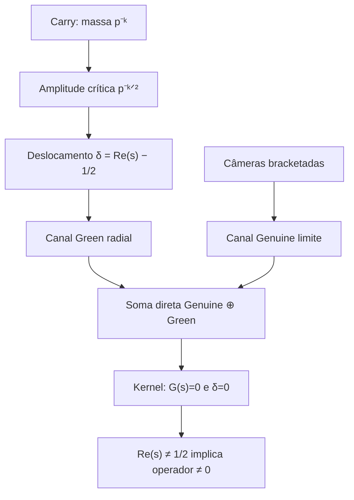

# O OPERADOR GENUINE–GREEN COMPLETADO É NÃO NULO FORA DA MEIA-ABSCISSA

## Documento matemático do teorema `genuineGreenCompletedLimitOperator_ne_zero_of_re_ne_half`

> **Resultado central.** Para duas bases primas `p` e `q` e para todo parâmetro
> `s` no interior da faixa Genuine, se
>
> $$
> \operatorname{Re}(s)\ne\frac12,
> $$
>
> então o operador-limite que preserva em soma direta o canal Genuine e o
> canal Green do carry não é o operador zero.

---

## 1. Identificação formal

- **Repositório:** `thiagomassensini/primos`
- **Branch formalizada:** `agent/genuine-carry-completed-operator`
- **Pull request:** [PR #5 — Formalize the carry-completed Genuine operator](https://github.com/thiagomassensini/primos/pull/5)
- **Módulo principal:** `CPFormal/Analytic/CpGenuineGreenCompletedOperator.lean`
- **Teorema principal:** `genuineGreenCompletedLimitOperator_ne_zero_of_re_ne_half`
- **Verificação:** `Lean kernel audit` #424, com `lake build --wfail`
- **Objeto da conclusão:** um endomorfismo linear complexo sobre a soma direta
  `GenuineGreenCompletedSpace`

O resultado foi elaborado pelo kernel do Lean sem `sorry`, `axiom` ou `admit`.

---

## 2. Enunciado exato

O tipo Lean do teorema é:

```lean
theorem genuineGreenCompletedLimitOperator_ne_zero_of_re_ne_half
    (p q : ℕ) (hp : Nat.Prime p) (hq : Nat.Prime q)
    {s : ℂ} (hs : s ∈ genuineCriticalStrip)
    (hoff : s.re ≠ (1 : ℝ) / 2) :
    genuineGreenCompletedLimitOperator p q s ≠ 0
```

Em notação matemática, sejam:

$$
p,q\in\mathbb P,
\qquad
s=\sigma+it\in\mathbb C,
\qquad
0<\sigma<1.
$$

Então:

$$
\boxed{
\sigma\ne\frac12
\quad\Longrightarrow\quad
\mathcal C_{p,q}(s)\ne0,
}
$$

onde

$$
\mathcal C_{p,q}(s)
=
\operatorname{genuineGreenCompletedLimitOperator}(p,q,s).
$$

Aqui `0` no lado direito significa o **endomorfismo linear zero**. Portanto, a
conclusão é que existe algum estado do espaço completado sobre o qual o
operador age de forma não nula.

O enunciado não afirma, por si só, que o operador é injetivo, invertível ou
que todo vetor não nulo possui imagem não nula. A propriedade kernel-checked é
precisamente

$$
\mathcal C_{p,q}(s)\ne 0_{\operatorname{End}}.
$$

---

## 3. Hipóteses realmente usadas

| Hipótese Lean | Tradução matemática | Função na prova |
|---|---|---|
| `p q : ℕ` | duas bases naturais | indexam as câmeras |
| `hp : Nat.Prime p` | $p$ é primo | rigidez do fator radial da primeira câmera |
| `hq : Nat.Prime q` | $q$ é primo | valida o canal Green alinhado de duas câmeras |
| `hs : s ∈ genuineCriticalStrip` | $0<\operatorname{Re}(s)<1$ | garante positividade da energia Green infinita |
| `hoff : s.re ≠ 1/2` | $\operatorname{Re}(s)\ne1/2$ | contradiz a caracterização do kernel |

O teorema principal não exige:

- que `p` e `q` sejam distintos;
- uma hipótese de que `genuineContinuation s = 0`;
- uma hipótese de fechamento Green;
- uma hipótese de saturação do carry;
- uma sequência de cutoffs escolhida externamente;
- um vetor especial do espaço de estados.

A paridade ímpar de `p` e `q` aparece na proveniência finita das câmeras
Genuine, mas não é uma hipótese do teorema de não-anulação do operador-limite.

---

## 4. Sequência conceitual



A ideia matemática é preservar simultaneamente duas informações que já
existiam na formalização:

1. o readout Genuine das câmeras bracketadas;
2. o fluxo Green radial produzido pelo desequilíbrio da amplitude do carry.

O primeiro canal detecta o fechamento escalar das câmeras. O segundo detecta
se a amplitude do ramo está ou não no equilíbrio quadrático. A soma direta
impede que uma dessas informações seja descartada pela outra.

---

## 5. Fundação: massa e amplitude do carry

Para uma base prima `p` e uma profundidade vertical `k`, a formalização parte
da massa

$$
m_{p,k}=p^{-k}
$$

e da amplitude crítica

$$
a_{p,k}=p^{-k/2}.
$$

O teorema `criticalAmplitude_sq_eq_mass` prova

$$
a_{p,k}^{,2}=m_{p,k}.
$$

Para uma abscissa real geral `σ`, a amplitude de ramo é

$$
a_{p,k}(\sigma)=p^{-k\sigma}.
$$

Na primeira camada,

$$
a_{p,1}(\sigma)=p^{-\sigma}.
$$

A razão vertical usada pelo Green vestido é definida por

$$
q_p
:=
\operatorname{primeCarryAmplitudeRatio}(p)
=
(\sqrt p)^{-1}
=p^{-1/2}.
$$

O módulo `CpCarryAmplitudeIdentification.lean` prova que essa razão não é uma
calibração independente:

$$
\boxed{
q_p
=
\operatorname{criticalAmplitude}(p,1).
}
$$

**Nome Lean:**
`primeCarryAmplitudeRatio_eq_criticalAmplitude_one`.

Para `p` primo, a coincidência da amplitude de ramo com a razão vertical do
carry é rígida:

$$
\boxed{
\operatorname{branchAmplitude}(p,\sigma,1)=q_p
\iff
\sigma=\frac12.
}
$$

**Nome Lean:**
`branchAmplitude_one_eq_primeCarryAmplitudeRatio_iff`.

Essa equivalência fornece a leitura em amplitude do equilíbrio transversal
que aparecerá no kernel do operador completado.

---

## 6. Deslocamento crítico e fator radial

Define-se o deslocamento transversal por

$$
\delta(s)
:=
\operatorname{criticalDisplacement}(\operatorname{Re}(s))
=
\operatorname{Re}(s)-\frac12.
$$

Para cada base prima `p`, o fator radial orientado é

$$
D_p(\delta)
:=
\operatorname{cpRadialDifference}(p,\delta)
=
p^{\delta}-p^{-\delta}.
$$

Ele possui a fatoração

$$
D_p(\delta)
=
2\delta\,C_p(\delta),
$$

onde

$$
C_p(\delta)
=
\operatorname{cpRadialCofactor}(p,\delta)>0.
$$

**Teoremas Lean:**

- `cpRadialDifference_eq_two_mul_delta_mul_cofactor`;
- `cpRadialCofactor_pos`;
- `cpRadialDifference_eq_zero_iff`.

Consequentemente,

$$
\boxed{
D_p(\delta)=0
\iff
\delta=0
\iff
\operatorname{Re}(s)=\frac12.
}
$$

Fora da meia-abscissa, o fator radial tem o mesmo sinal de `δ` e não pode ser
apagado internamente por uma mudança de fase.

---

## 7. O canal Genuine ortogonal

### 7.1 Espaço de duas câmeras

O espaço complexo das duas câmeras é

$$
H_G
:=
\operatorname{TwoPrimeGenuineHilbert}
=
\operatorname{EuclideanSpace}_{\mathbb C}(\operatorname{Fin}2)
\cong\mathbb C^2.
$$

Os eixos das duas câmeras são formalmente ortogonais:

$$
\langle (x,0),(0,y)\rangle=0.
$$

**Nome Lean:**
`firstPrimeGenuineAxis_inner_secondPrimeGenuineAxis`.

### 7.2 Operador-limite Genuine

Escreva

$$
G(s):=\operatorname{genuineContinuation}(s).
$$

O operador Genuine ortogonal no limite é

$$
\mathcal G_\infty(s)
=
\begin{pmatrix}
G(s)&0\\
0&G(s)
\end{pmatrix}
\in\operatorname{End}_{\mathbb C}(H_G).
$$

No Lean:

$$
\operatorname{orthogonalGenuineLimitOperator}(s),v
=G(s)v.
$$

**Teorema Lean:**
`orthogonalGenuineLimitOperator_apply`.

Como as duas coordenadas possuem o mesmo coeficiente,

$$
\boxed{
\mathcal G_\infty(s)=0
\iff
G(s)=0.
}
$$

**Teorema Lean:**
`orthogonalGenuineLimitOperator_eq_zero_iff`.

### 7.3 Origem nas câmeras finitas

Para uma câmera prima `p`, define-se a câmera normalizada finita

$$
G_{p,M}(s)
=
\frac{B_{p,M}(s)}{F_p(s)},
$$

onde `B_{p,M}` é a carta bracketada finita e `F_p` é o fator da câmera.
Nos cutoffs cruzados alinhados, as câmeras `p` e `q` são preservadas em
coordenadas distintas. Para cada vetor `v∈H_G`, o Lean prova convergência
forte estado por estado:

$$
\mathcal G^{(L)}_{p,q}(s)v
\longrightarrow
\mathcal G_\infty(s)v.
$$

**Teoremas Lean:**

- `finiteNormalizedGenuineCamera_tendsto_genuineContinuation`;
- `finiteAlignedOrthogonalGenuineVector_tendsto_limit`;
- `finiteAlignedOrthogonalGenuineOperator_tendsto_apply`.

---

## 8. O canal Green alinhado

### 8.1 Energia refletida infinita

Seja

$$
E_\infty(s)
:=
\operatorname{infiniteReflectedGreenEnergy}(s).
$$

No interior da faixa Genuine, a formalização prova

$$
\boxed{E_\infty(s)>0.}
$$

**Teorema Lean:**
`infiniteReflectedGreenEnergy_pos`.

Essa positividade é decisiva: o produto radial só pode zerar pelo fator
`D_p(δ)`, nunca por desaparecimento da energia.

### 8.2 Vetor Green de duas câmeras

O vetor-limite Green alinhado é

$$
L_{p,q}(s)
=
\begin{pmatrix}
D_p(\delta(s))E_\infty(s)\\
D_q(\delta(s))E_\infty(s)
\end{pmatrix}
\in\mathbb R^2.
$$

No Lean, esse objeto é
`crossPrimeAlignedGreenLimitVector p q s`.

Como `E∞(s)>0` e `D_p(δ)=0 ↔ δ=0`, o Lean prova

$$
\boxed{
L_{p,q}(s)=0
\iff
\delta(s)=0.
}
$$

**Teorema Lean:**
`crossPrimeAlignedGreenLimitVector_eq_zero_iff_criticalDisplacement_eq_zero`.

### 8.3 Complexificação diagonal

O vetor real Green é convertido em dois coeficientes complexos diagonais:

$$
\mathcal L_{p,q}(s)
=
\begin{pmatrix}
D_p(\delta(s))E_\infty(s)&0\\
0&D_q(\delta(s))E_\infty(s)
\end{pmatrix}
\in\operatorname{End}_{\mathbb C}(H_G).
$$

Esse é o objeto Lean
`complexifiedAlignedGreenLimitOperator p q s`.

A complexificação não altera o locus de anulação:

$$
\mathcal L_{p,q}(s)=0
\iff
L_{p,q}(s)=0.
$$

**Teorema Lean:**
`complexifiedAlignedGreenLimitOperator_eq_zero_iff_limitVector_eq_zero`.

Juntando as duas equivalências:

$$
\boxed{
\mathcal L_{p,q}(s)=0
\iff
\delta(s)=0
\iff
\operatorname{Re}(s)=\frac12.
}
$$

**Teorema Lean:**
`complexifiedAlignedGreenLimitOperator_eq_zero_iff_criticalDisplacement_eq_zero`.

---

## 9. Construção do operador completado

### 9.1 Espaço completado

O espaço total é a soma direta dos dois canais:

$$
H_{\mathrm{comp}}
:=
H_G\oplus H_G
\cong
\mathbb C^2\oplus\mathbb C^2.
$$

No Lean:

```lean
abbrev GenuineGreenCompletedSpace :=
  TwoPrimeGenuineHilbert × TwoPrimeGenuineHilbert
```

O primeiro bloco guarda o readout Genuine; o segundo guarda o fluxo Green
alinhado complexificado.

### 9.2 Definição por soma direta

O operador-limite completado é

$$
\boxed{
\mathcal C_{p,q}(s)
:=
\mathcal G_\infty(s)\oplus\mathcal L_{p,q}(s).
}
$$

No Lean, a soma direta é implementada por `LinearMap.prodMap`:

```lean
def genuineGreenCompletedLimitOperator
    (p q : ℕ) (s : ℂ) : Module.End ℂ GenuineGreenCompletedSpace :=
  (orthogonalGenuineLimitOperator s).prodMap
    (complexifiedAlignedGreenLimitOperator p q s)
```

Se um estado é escrito como

$$
v=((x_p,x_q),(y_p,y_q)),
$$

então

$$
\mathcal C_{p,q}(s)v
=
\left(
\begin{pmatrix}
G(s)x_p\\G(s)x_q
\end{pmatrix},
\begin{pmatrix}
D_p(\delta)E_\infty(s)y_p\\
D_q(\delta)E_\infty(s)y_q
\end{pmatrix}
\right).
$$

Não há soma entre os coeficientes Genuine e Green, nem termo cruzado entre as
câmeras. Cada informação permanece em sua própria coordenada.

---

## 10. Por que a soma direta é uma completude geométrica

O segundo bloco não é um residual definido depois da conclusão. Antes do
operador completado, a formalização já possuía separadamente:

- as câmeras Genuine finitas normalizadas;
- o operador Genuine ortogonal no limite;
- os fluxos Green finitos nos cutoffs cruzados;
- o vetor Green alinhado no limite;
- a positividade da energia Green infinita;
- a rigidez do fator radial `D_p(δ)`;
- a convergência dos objetos finitos para esses dois limites.

O operador completado apenas aplica a construção canônica de produto a dois
endomorfismos previamente definidos:

$$
(A,B)\mapsto A\oplus B.
$$

A informação que antes era lida em dois registros passa a ser preservada por
um único operador de bloco diagonal. Nenhuma equação é calibrada em função de
um zero e nenhum coeficiente novo é escolhido para fabricar o kernel.

---

## 11. Lema algébrico da soma direta

Para endomorfismos `A` e `B`, o Lean prova

$$
\boxed{
A\oplus B=0
\iff
A=0\ \land\ B=0.
}
$$

**Teorema Lean:**
`linearMap_prodMap_eq_zero_iff`.

A demonstração avalia o produto em estados dos tipos `(v,0)` e `(0,w)`:

$$
(A\oplus B)(v,0)=(Av,0),
$$

$$
(A\oplus B)(0,w)=(0,Bw).
$$

Se o produto é o operador zero, essas duas avaliações forçam `A=0` e `B=0`.
A recíproca é imediata.

Aplicado aos dois canais:

$$
\boxed{
\mathcal C_{p,q}(s)=0
\iff
\mathcal G_\infty(s)=0
\ \land\
\mathcal L_{p,q}(s)=0.
}
$$

**Teorema Lean:**
`genuineGreenCompletedLimitOperator_eq_zero_iff_components`.

---

## 12. Caracterização intrínseca do kernel

Substituindo as caracterizações dos dois blocos,

$$
\mathcal G_\infty(s)=0
\iff
G(s)=0,
$$

e

$$
\mathcal L_{p,q}(s)=0
\iff
\delta(s)=0,
$$

obtém-se:

$$
\boxed{
\mathcal C_{p,q}(s)=0
\iff
G(s)=0
\ \land\
\delta(s)=0.
}
$$

**Teorema Lean:**
`genuineGreenCompletedLimitOperator_eq_zero_iff`.

Como

$$
\delta(s)=0
\iff
\operatorname{Re}(s)=\frac12,
$$

a forma coordenada é

$$
\boxed{
\mathcal C_{p,q}(s)=0
\iff
G(s)=0
\ \land\
\operatorname{Re}(s)=\frac12.
}
$$

**Teorema Lean:**
`genuineGreenCompletedLimitOperator_eq_zero_iff_re_eq_half`.

Essa equivalência é o teorema estrutural do qual a não-anulação fora da
meia-abscissa é um corolário direto.

---

## 13. Caracterização em linguagem de carry

Usando a identificação

$$
q_p=\operatorname{criticalAmplitude}(p,1)
$$

e a rigidez

$$
\operatorname{branchAmplitude}(p,\sigma,1)=q_p
\iff
\sigma=\frac12,
$$

o kernel também é caracterizado por

$$
\boxed{
\mathcal C_{p,q}(s)=0
\iff
G(s)=0
\ \land\
\operatorname{branchAmplitude}
  (p,\operatorname{Re}(s),1)
=
\operatorname{primeCarryAmplitudeRatio}(p).
}
$$

**Teorema Lean:**
`genuineGreenCompletedLimitOperator_eq_zero_iff_carryAmplitude`.

Esta forma remove a aparência de que `1/2` foi apenas inserido como uma
coordenada especial. O segundo termo diz literalmente:

> a amplitude analítica da primeira camada coincide com a amplitude
> quadrática determinada pela massa do carry.

Portanto, o kernel total exige simultaneamente:

1. fechamento do canal Genuine;
2. saturação da amplitude do carry.

---

## 14. Prova do teorema de não-anulação

Assuma

$$
\operatorname{Re}(s)\ne\frac12.
$$

Queremos provar

$$
\mathcal C_{p,q}(s)\ne0.
$$

### Passo 1 — hipótese de contradição

Suponha

$$
\mathcal C_{p,q}(s)=0.
$$

### Passo 2 — aplicação da caracterização do kernel

Pelo teorema
`genuineGreenCompletedLimitOperator_eq_zero_iff_re_eq_half`, segue

$$
G(s)=0
\quad\text{e}\quad
\operatorname{Re}(s)=\frac12.
$$

### Passo 3 — extração da segunda coordenada lógica

Da conjunção anterior, usa-se apenas

$$
\operatorname{Re}(s)=\frac12.
$$

### Passo 4 — contradição

Isso contradiz a hipótese

$$
\operatorname{Re}(s)\ne\frac12.
$$

Logo,

$$
\boxed{
\mathcal C_{p,q}(s)\ne0.
}
$$

A prova Lean possui exatamente essa estrutura:

```lean
by
  intro hzero
  exact hoff
    ((genuineGreenCompletedLimitOperator_eq_zero_iff_re_eq_half
      p q hp hq hs).1 hzero).2
```

O papel matemático pesado está na caracterização anterior do kernel. O
teorema `ne_zero` é a contraposição final dessa caracterização.

---

## 15. Leitura geométrica da prova

Fora da meia-abscissa,

$$
\delta(s)\ne0.
$$

Então, para toda base prima `p`,

$$
D_p(\delta(s))\ne0.
$$

Como

$$
E_\infty(s)>0,
$$

temos

$$
D_p(\delta(s))E_\infty(s)\ne0.
$$

Assim, o canal Green é um endomorfismo não nulo. Mesmo que o readout Genuine
seja zero, o par ordenado de operadores é

$$
(0,\mathcal L_{p,q}(s)),
\qquad
\mathcal L_{p,q}(s)\ne0.
$$

Uma soma direta só é zero quando todos os seus blocos são zero. Portanto, o
operador completo não pode desaparecer.

Em linguagem de energia:

> o fechamento do observador Genuine pode apagar o canal visível, mas fora do
> equilíbrio quadrático o fluxo radial permanece registrado numa coordenada
> ortogonal do estado completado.

---

## 16. Corolário no locus de zero Genuine

A formalização nomeia explicitamente o caso que motivou a construção:

```lean
theorem genuine_zero_has_nonzero_completed_limitOperator_of_re_ne_half
```

Em notação matemática:

$$
G(s)=0
\quad\land\quad
\operatorname{Re}(s)\ne\frac12
\quad\Longrightarrow\quad
\mathcal C_{p,q}(s)\ne0.
$$

Observe que a hipótese `G(s)=0` não é necessária para a não-anulação do
operador completo. Ela é incluída nesse corolário para explicitar o caso em
que o primeiro bloco fecha e o segundo bloco sozinho preserva a informação
off-critical.

---

## 17. Proveniência finita do operador completado

### 17.1 Operador finito

Para um cutoff `L`, define-se

$$
\mathcal C^{(L)}_{p,q}(s)
=
\mathcal G^{(L)}_{p,q}(s)
\oplus
\mathcal L^{(L)}_{p,q}(s),
$$

onde:

- `finiteAlignedOrthogonalGenuineOperator` é o bloco Genuine finito;
- `finiteComplexifiedAlignedGreenFluxOperator` é o bloco Green finito;
- `finiteGenuineGreenCompletedOperator` é o produto dos dois blocos.

### 17.2 Convergência do bloco Green

Se `G(s)=0`, o Lean prova, para todo estado `v∈H_G`,

$$
\mathcal L^{(L)}_{p,q}(s)v
\longrightarrow
\mathcal L_{p,q}(s)v.
$$

**Teorema Lean:**
`finiteComplexifiedAlignedGreenFluxOperator_tendsto_apply_of_genuine_zero`.

Essa passagem deriva do limite coordenada a coordenada

$$
\operatorname{crossPrimeAlignedGreenFluxVector}(p,q,L,s)
\longrightarrow
L_{p,q}(s).
$$

**Teorema Lean:**
`crossPrimeAlignedGreenFluxVector_tendsto_limit_of_genuine_zero`.

### 17.3 Convergência forte do operador completo

Para primos ímpares `p` e `q`, `s` na faixa Genuine e `G(s)=0`, o Lean prova,
para todo estado `v∈Hcomp`,

$$
\boxed{
\mathcal C^{(L)}_{p,q}(s)v
\longrightarrow
\mathcal C_{p,q}(s)v.
}
$$

**Teorema Lean:**
`finiteGenuineGreenCompletedOperator_tendsto_apply_of_genuine_zero`.

Portanto, no locus de zero Genuine, o operador completado não é apenas uma
colagem formal de dois objetos infinitos: ele é o limite forte, estado por
estado, da família finita que preserva simultaneamente o readout Genuine e o
fluxo Green.

---

## 18. Restrição à órbita real-espectral

O parâmetro real-espectral é

$$
s_t
:=
\operatorname{criticalLineParameter}(t)
=
\frac12+it.
$$

O estado associado é

$$
\operatorname{realSpectralState}(t,n)
=(n+1)^{-s_t},
$$

e sua norma é

$$
\left\|\operatorname{realSpectralState}(t,n)\right\|
=(n+1)^{-1/2}.
$$

Assim, `t` altera a fase do estado, enquanto a amplitude crítica permanece
fixada pela geometria do carry.

Define-se

$$
G_{\mathbb R}(t)
:=
\operatorname{realSpectralGenuine}(t)
=
G(s_t).
$$

Como

$$
\operatorname{Re}(s_t)=\frac12,
$$

o canal Green radial já está equilibrado por construção. O kernel do operador
completado reduz então exatamente ao kernel do Genuine real-espectral:

$$
\boxed{
\mathcal C_{p,q}(s_t)=0
\iff
G_{\mathbb R}(t)=0.
}
$$

**Teorema Lean:**
`genuineGreenCompletedLimitOperator_criticalLine_eq_zero_iff`.

Essa especialização mostra os dois regimes do mesmo operador:

| Regime | Canal Green | Condição para o operador total zerar |
|---|---:|---|
| $\operatorname{Re}(s)\ne1/2$ | não nulo | impossível |
| $s=1/2+it$ | zero | $G_{\mathbb R}(t)=0$ |

---

## 19. Concordância entre câmeras como detector alternativo

Quando `p` e `q` são primos distintos, a formalização prova a rigidez

$$
D_p(\delta)=D_q(\delta)
\iff
\delta=0.
$$

**Teorema Lean:**
`cpRadialDifference_eq_cpRadialDifference_iff`.

Como as duas coordenadas Green compartilham a mesma energia positiva,

$$
L_{p,q}(s)_0=L_{p,q}(s)_1
\iff
\delta(s)=0.
$$

**Teorema Lean:**
`crossPrimeAlignedGreenLimitVector_coordinates_eq_iff`.

Essa é uma leitura alternativa da mesma rigidez: não é necessário pedir que
as duas coordenadas Green sejam zero; para bases primas distintas, a simples
concordância entre elas já detecta o equilíbrio transversal.

Esse teorema não é usado na prova principal de não-anulação. Ele registra uma
segunda rota estrutural disponível no mesmo módulo.

---

## 20. Escopo lógico exato

É essencial distinguir três afirmações.

### 20.1 Teorema provado do operador completado

$$
\boxed{
\operatorname{Re}(s)\ne\frac12
\Longrightarrow
\mathcal C_{p,q}(s)\ne0.
}
$$

Este é
`genuineGreenCompletedLimitOperator_ne_zero_of_re_ne_half`.

### 20.2 Caracterização completa do zero do operador

$$
\boxed{
\mathcal C_{p,q}(s)=0
\iff
G(s)=0
\land
\operatorname{Re}(s)=\frac12.
}
$$

Este é
`genuineGreenCompletedLimitOperator_eq_zero_iff_re_eq_half`.

### 20.3 Afirmação diferente sobre o escalar Genuine isolado

A proposição

$$
\operatorname{Re}(s)\ne\frac12
\Longrightarrow
G(s)\ne0
$$

não é equivalente à não-anulação do operador completado. O operador total
pode ser não nulo pelo canal Green mesmo quando `G(s)=0`.

Em símbolos, fora da meia-abscissa é compatível com o teorema do operador a
configuração

$$
G(s)=0,
\qquad
\mathcal G_\infty(s)=0,
\qquad
\mathcal L_{p,q}(s)\ne0,
\qquad
\mathcal C_{p,q}(s)\ne0.
$$

Assim, o resultado formalizado identifica com precisão o objeto que não pode
zerar: o operador que preserva conjuntamente as informações Genuine e Green.

---

## 21. Relação com a representação real por rotações

Um número complexo

$$
re^{-i\theta}
$$

age sobre o plano real como a matriz

$$
r
\begin{pmatrix}
\cos\theta&\sin\theta\\
-\sin\theta&\cos\theta
\end{pmatrix}.
$$

Por isso, a escrita complexa do estado real-espectral é equivalente à leitura
de amplitude mais rotação em `ℝ²`. No operador formal:

- a amplitude crítica é fixada por `p^{-k/2}`;
- `t` aparece como rotação de fase;
- o bracket produz as câmeras Genuine;
- o produto de duas câmeras mantém seus eixos separados;
- o segundo bloco registra o desequilíbrio radial que a projeção Genuine pode
  deixar invisível.

O teorema do operador completado pode, portanto, ser lido em linguagem de
matrizes reais: fora do equilíbrio quadrático, o bloco radial possui escala
não nula e impede que a matriz total seja a matriz zero.

---

## 22. Mapa de dependências Lean

| Etapa matemática | Definição ou teorema Lean | Módulo principal |
|---|---|---|
| massa do carry | `criticalMass` | `CpBranchWeight.lean` |
| amplitude crítica | `criticalAmplitude` | `CpBranchWeight.lean` |
| amplitude² = massa | `criticalAmplitude_sq_eq_mass` | `CpBranchWeight.lean` |
| razão vertical | `primeCarryAmplitudeRatio` | `CpCarryWeightedVerticalGreen.lean` |
| razão = amplitude crítica | `primeCarryAmplitudeRatio_eq_criticalAmplitude_one` | `CpCarryAmplitudeIdentification.lean` |
| rigidez da amplitude | `branchAmplitude_one_eq_primeCarryAmplitudeRatio_iff` | `CpCarryAmplitudeIdentification.lean` |
| deslocamento transversal | `criticalDisplacement` | `CpBranchNorm.lean` |
| diferença radial | `cpRadialDifference` | `CpFiniteGreenRadial.lean` |
| fatoração radial | `cpRadialDifference_eq_two_mul_delta_mul_cofactor` | `CpFiniteGreenRadial.lean` |
| Genuine canônico | `genuineContinuation` | `CpGenuineCompatibility.lean` |
| espaço de duas câmeras | `TwoPrimeGenuineHilbert` | `CpGenuineFirstOrthogonalLimit.lean` |
| operador Genuine limite | `orthogonalGenuineLimitOperator` | `CpGenuineFirstOrthogonalLimit.lean` |
| kernel do bloco Genuine | `orthogonalGenuineLimitOperator_eq_zero_iff` | `CpGenuineFirstOrthogonalGreenLimit.lean` |
| energia Green infinita | `infiniteReflectedGreenEnergy` | `CpGenuineFirstOrthogonalGreenLimit.lean` |
| vetor Green limite | `crossPrimeAlignedGreenLimitVector` | `CpGenuineFirstOrthogonalGreenLimit.lean` |
| kernel do vetor Green | `crossPrimeAlignedGreenLimitVector_eq_zero_iff_criticalDisplacement_eq_zero` | `CpGenuineFirstOrthogonalGreenLimit.lean` |
| bloco Green complexo | `complexifiedAlignedGreenLimitOperator` | `CpGenuineGreenCompletedOperator.lean` |
| espaço completado | `GenuineGreenCompletedSpace` | `CpGenuineGreenCompletedOperator.lean` |
| operador completado | `genuineGreenCompletedLimitOperator` | `CpGenuineGreenCompletedOperator.lean` |
| kernel por blocos | `genuineGreenCompletedLimitOperator_eq_zero_iff_components` | `CpGenuineGreenCompletedOperator.lean` |
| kernel intrínseco | `genuineGreenCompletedLimitOperator_eq_zero_iff` | `CpGenuineGreenCompletedOperator.lean` |
| kernel em amplitude | `genuineGreenCompletedLimitOperator_eq_zero_iff_carryAmplitude` | `CpGenuineGreenCompletedOperator.lean` |
| kernel em coordenada | `genuineGreenCompletedLimitOperator_eq_zero_iff_re_eq_half` | `CpGenuineGreenCompletedOperator.lean` |
| não-anulação off-critical | `genuineGreenCompletedLimitOperator_ne_zero_of_re_ne_half` | `CpGenuineGreenCompletedOperator.lean` |
| limite forte finito | `finiteGenuineGreenCompletedOperator_tendsto_apply_of_genuine_zero` | `CpGenuineGreenCompletedOperator.lean` |
| restrição real-espectral | `genuineGreenCompletedLimitOperator_criticalLine_eq_zero_iff` | `CpGenuineGreenCompletedOperator.lean` |

---

## 23. Arquivos-fonte centrais

- [`CpGenuineGreenCompletedOperator.lean`](https://github.com/thiagomassensini/primos/blob/agent/genuine-carry-completed-operator/CPFormal/Analytic/CpGenuineGreenCompletedOperator.lean) — definição do operador completado, caracterização do kernel, não-anulação, proveniência finita e restrição real-espectral.
- [`CpCarryAmplitudeIdentification.lean`](https://github.com/thiagomassensini/primos/blob/agent/genuine-carry-completed-operator/CPFormal/Analytic/CpCarryAmplitudeIdentification.lean) — identificação da razão vertical com a amplitude crítica e rigidez em `σ=1/2`.
- [`CpGenuineFirstOrthogonalGreenLimit.lean`](https://github.com/thiagomassensini/primos/blob/agent/genuine-carry-completed-operator/CPFormal/Analytic/CpGenuineFirstOrthogonalGreenLimit.lean) — energia Green infinita, vetor Green limite e kernel conjunto.
- [`CpGenuineFirstOrthogonalLimit.lean`](https://github.com/thiagomassensini/primos/blob/agent/genuine-carry-completed-operator/CPFormal/Analytic/CpGenuineFirstOrthogonalLimit.lean) — câmeras ortogonais, operador Genuine no limite e convergência forte.
- [`CpRealSpectralOperator.lean`](https://github.com/thiagomassensini/primos/blob/agent/genuine-carry-completed-operator/CPFormal/Analytic/CpRealSpectralOperator.lean) — estado real-espectral, órbita `criticalLineParameter t` e Genuine real-espectral.
- [`CpFiniteGreenRadial.lean`](https://github.com/thiagomassensini/primos/blob/agent/genuine-carry-completed-operator/CPFormal/Analytic/CpFiniteGreenRadial.lean) — normalização de fase, diferença radial e cofator positivo.
- [`CpGenuineCompatibility.lean`](https://github.com/thiagomassensini/primos/blob/agent/genuine-carry-completed-operator/CPFormal/Analytic/CpGenuineCompatibility.lean) — independência das câmeras e definição de `genuineContinuation`.

---

## 24. Forma compacta da prova inteira

Defina

$$
\begin{aligned}
G(s)&:=\operatorname{genuineContinuation}(s),\\
\delta(s)&:=\operatorname{Re}(s)-\frac12,\\
D_r(\delta)&:=r^\delta-r^{-\delta},\\
E(s)&:=\operatorname{infiniteReflectedGreenEnergy}(s)>0,\\
\mathcal G_\infty(s)&:=\operatorname{diag}(G(s),G(s)),\\
\mathcal L_{p,q}(s)&:=
\operatorname{diag}(D_p(\delta(s))E(s),D_q(\delta(s))E(s)),\\
\mathcal C_{p,q}(s)&:=\mathcal G_\infty(s)\oplus\mathcal L_{p,q}(s).
\end{aligned}
$$

Então:

$$
\begin{aligned}
\mathcal C_{p,q}(s)=0
&\iff
\mathcal G_\infty(s)=0
\land
\mathcal L_{p,q}(s)=0\\
&\iff
G(s)=0
\land
D_p(\delta(s))E(s)=0
\land
D_q(\delta(s))E(s)=0\\
&\iff
G(s)=0
\land
\delta(s)=0\\
&\iff
G(s)=0
\land
\operatorname{Re}(s)=\frac12.
\end{aligned}
$$

Portanto,

$$
\boxed{
\operatorname{Re}(s)\ne\frac12
\Longrightarrow
\mathcal C_{p,q}(s)\ne0.
}
$$

E, em coordenadas de amplitude do carry,

$$
\boxed{
\mathcal C_{p,q}(s)=0
\iff
G(s)=0
\land
\operatorname{branchAmplitude}(p,\operatorname{Re}(s),1)
=\operatorname{criticalAmplitude}(p,1).
}
$$

Essa é a transcrição matemática completa do conteúdo formalizado pelo teorema
`genuineGreenCompletedLimitOperator_ne_zero_of_re_ne_half` e pelos lemas que
constroem sua caracterização de kernel.
