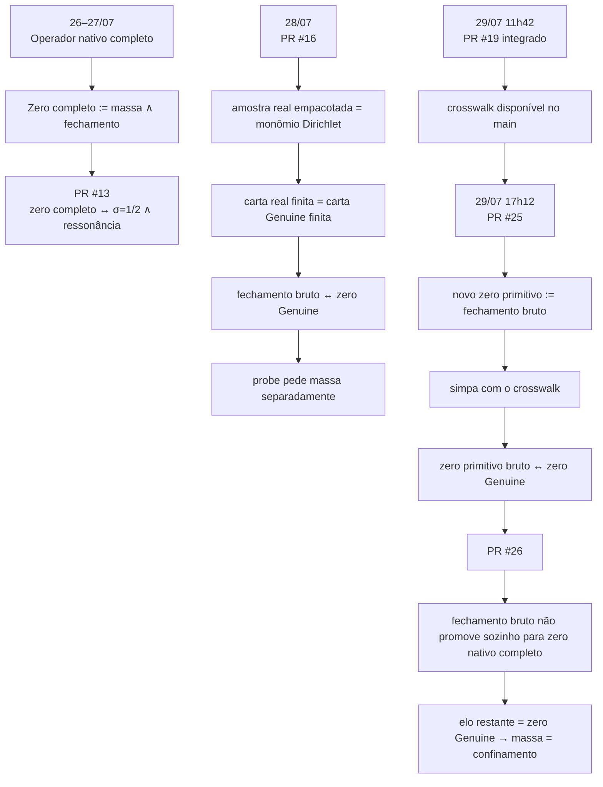

# Cronologia do PR #25 — quando o zero primitivo bruto e o zero Genuine viraram o mesmo conjunto de zeros

> **Arquivo histórico.** A distinção posterior entre “zero bruto” e “zero
> nativo completo” foi eliminada da API: zero é fechamento, enquanto massa e
> Green são propriedades separadas. Consulte
> `docs/NATIVE_ZERO_SEMANTICS_CORRECTION.md`.

> Reconstrução histórica e lógica da retirada da compatibilidade de massa do predicado primitivo, da reutilização do crosswalk real/complexo e da prova Lean de que, no strip aberto, o fechamento primitivo bruto e `genuineContinuation = 0` descrevem exatamente o mesmo locus.

---

## 1. Resumo em uma frase

O PR #25 não provou que a massa desapareceu da geometria do carry.

Ele fez uma separação lógica mais limpa:

- chamou de **zero primitivo bruto** apenas o fechamento da câmera real;
- deixou a compatibilidade de massa fora desse predicado;
- reutilizou o crosswalk já provado;
- e o Lean concluiu:

```lean
IsPrimitiveNativeCarryRealOperatorZero sigma time ↔
  genuineContinuation
    (nativeCarryRealPlaneParameter sigma time) = 0
```

para `0 < sigma < 1`.

Portanto:

$$
\boxed{
\text{zero primitivo bruto}
\iff
\text{zero Genuine}
}
$$

no strip crítico aberto.

Isso é uma identidade exata de **predicados de zero**. Não é uma afirmação de que o operador nativo completo, com seu domínio de massa, foi apagado ou substituído.

---

## 2. A distinção que motivou o PR

Antes do PR #25, o repositório já continha duas informações diferentes, mas elas ainda apareciam misturadas na conversa sobre “zero primitivo”.

### 2.1 Fechamento bruto da câmera

O fechamento bruto era:

```lean
NativeCarryRealOperatorBoundaryClosesAt camera sigma time
```

Ele dizia somente que a sequência dos resultantes reais finitos convergia a zero:

```lean
Tendsto
  (fun cutoff =>
    nativeCarryRealPlaneFiniteChartAt camera cutoff sigma time)
  atTop
  (nhds 0)
```

Esse é o fenômeno de cancelamento observado pela câmera.

### 2.2 Zero nativo completo

O zero nativo completo havia sido definido como:

```lean
def IsNativeCarryRealOperatorZero
    (camera : ℕ) (sigma time : ℝ) : Prop :=
  NativeCarryRealPlaneMassCompatible sigma time ∧
    NativeCarryRealOperatorBoundaryClosesAt camera sigma time
```

Em símbolos:

$$
\boxed{
Z_{\mathrm{nativo}}(\sigma,t)
=
M(\sigma,t)\land B(\sigma,t)
}
$$

onde:

- $M$ é a compatibilidade da massa pré-compressão;
- $B$ é o fechamento bruto do bracket/câmera.

A massa não era uma conclusão tirada do cancelamento. Ela fazia parte do domínio do operador nativo completo.

---

## 3. O que o PR #13 havia provado

### 27 de julho de 2026 — 05h29 a 05h45, horário de Brasília

O PR #13, **“Prove exact native real-operator confinement”**, formalizou o operador real nativo completo.

- PR aberto: **27/07/2026 às 05h29**
- PR integrado: **27/07/2026 às 05h45**
- merge no `main`: `d24c42cbfa5ad4ea44629bcf193bbdbfabf6ef5d`

O teorema central foi:

```lean
theorem isNativeCarryRealOperatorZero_iff
    (camera : ℕ) (sigma time : ℝ) :
    IsNativeCarryRealOperatorZero camera sigma time ↔
      sigma = (1 : ℝ) / 2 ∧
        IsNativeCarryRealOperatorResonance camera time
```

Essa prova era direta porque o predicado já continha:

```lean
NativeCarryRealPlaneMassCompatible sigma time
```

e o repositório já sabia:

```lean
NativeCarryRealPlaneMassCompatible sigma time ↔
  sigma = 1 / 2
```

Assim, o confinamento do operador nativo completo era uma fatoração do domínio:

$$
M(\sigma,t)\land B(\sigma,t)
\iff
\left(\sigma=\frac12\right)\land B\left(\frac12,t\right).
$$

### O que isso não dizia

Esse teorema não dizia:

$$
B(\sigma,t)\Longrightarrow \sigma=\frac12.
$$

Ele dizia:

$$
M(\sigma,t)\land B(\sigma,t)
\Longrightarrow \sigma=\frac12.
$$

Essa diferença passou a ser o centro da investigação seguinte.

---

## 4. A pergunta que surgiu

A pergunta natural tornou-se:

> O cancelamento bruto da câmera real já é o mesmo zero observado pelo Genuine, ou a massa é necessária até para identificar os zeros?

Em linguagem Lean:

```lean
NativeCarryRealOperatorBoundaryClosesAt 3 s.re s.im
```

seria equivalente a:

```lean
genuineContinuation s = 0
```

sem incluir:

```lean
NativeCarryRealPlaneMassCompatible s.re s.im
```

?

Essa pergunta foi testada primeiro nos PRs #16 e #19.

---

## 5. PR #16 — construção do crosswalk sem massa

### 28 de julho de 2026 — 17h38, horário de Brasília

O PR #16 foi aberto como:

> **Genuine-first primitive real boundary crosswalk**

- aberto: **28/07/2026 às 17h38**
- head final: `e68cad52604e6957e19cd7cce8b1a9f21cafacad`
- encerrado em favor do veículo de integração PR #19

O objetivo era encontrar a rota mais curta entre:

- o campo real rotacional do operador primitivo;
- a carta complexa Genuine.

A construção aconteceu em quatro etapas.

### 5.1 Empacotamento real em duas coordenadas

Foi definido:

```lean
def nativeCarryRealPlaneParameter
    (sigma time : ℝ) : ℂ :=
  ⟨sigma, time⟩
```

isto é:

$$
s=\sigma+it.
$$

### 5.2 A amostra real empacotada é o monômio de Dirichlet

O Lean provou:

```lean
nativeCarryRealPlaneComplexPackaging
    (nativeCarryRealPlaneSampleAt sigma time n)
=
dirichletTerm
    (nativeCarryRealPlaneParameter sigma time) n
```

A notação complexa não criava um valor novo. Ela apenas empacotava:

$$
n^{-\sigma}
\begin{pmatrix}
\cos(-t\log n)\\
\sin(-t\log n)
\end{pmatrix}
$$

como:

$$
n^{-(\sigma+it)}.
$$

### 5.3 As cartas finitas eram literalmente as mesmas

Por naturalidade aditiva, o empacotamento de toda câmera real finita passou a coincidir com a carta Genuine finita:

```lean
nativeCarryRealPlaneComplexPackaging
    (nativeCarryRealPlaneFiniteChartAt p M sigma time)
=
CPFormal.Genuine.Cp.finiteChart p M
  (dirichletTerm
    (nativeCarryRealPlaneParameter sigma time))
```

Não houve uso de:

- compatibilidade de massa;
- Green;
- Cayley;
- Zeta;
- confinamento;
- hipótese sobre zeros.

### 5.4 Passagem ao limite nos dois sentidos

O PR provou as duas setas:

```lean
genuineContinuation s = 0
  →
NativeCarryRealOperatorBoundaryClosesAt 3 s.re s.im
```

e:

```lean
NativeCarryRealOperatorBoundaryClosesAt 3 s.re s.im
  →
genuineContinuation s = 0
```

resultando em:

```lean
theorem nativeCarryRealBoundaryClosure_iff_genuineContinuation_zero
    {s : ℂ} (hs : s ∈ genuineCriticalStrip) :
    NativeCarryRealOperatorBoundaryClosesAt 3 s.re s.im ↔
      genuineContinuation s = 0
```

Em símbolos:

$$
\boxed{
B_3(\operatorname{Re}s,\operatorname{Im}s)
\iff
G(s)=0
}
$$

para:

$$
0<\operatorname{Re}s<1.
$$

---

## 6. O probe terminal do PR #16

Depois de obter o crosswalk, foi tentada a composição direta com o teorema de confinamento do operador nativo completo:

```lean
nativeCarryRealOperatorZero_sigma_eq_half
```

O Lean aceitou o fechamento bruto, mas pediu exatamente:

```lean
⊢ NativeCarryRealPlaneMassCompatible s.re s.im
```

Isso foi decisivo.

O kernel estava dizendo:

```text
zero Genuine
    ↔ fechamento primitivo bruto
```

mas não:

```text
zero Genuine
    → compatibilidade de massa
```

Portanto, a diferença não estava:

- no plano complexo;
- na câmera 3;
- no limite;
- no empacotamento;
- na carta Genuine.

A diferença estava exatamente na massa retida no domínio do operador completo.

---

## 7. PR #19 — integração do crosswalk no `main`

### 29 de julho de 2026 — 11h35 a 11h42, horário de Brasília

O PR #19 foi o veículo limpo de integração do conteúdo do PR #16.

- aberto: **29/07/2026 às 11h35**
- integrado: **29/07/2026 às 11h42**
- merge no `main`: `8cee49af8fefc4baef61c1dc27ee5eabcf071878`
- head auditado: `a3fbe010cceddfad4dc2b6ba42db35757fbd2a9d`

O PR #19 preservou exatamente:

```lean
NativeCarryRealOperatorBoundaryClosesAt 3 s.re s.im ↔
  genuineContinuation s = 0
```

sem:

- Zeta;
- Green;
- massa quadrática;
- hipótese adicional.

Nesse momento, o repositório já possuía no `main` a equivalência necessária para o PR #25.

---

## 8. A virada conceitual do PR #25

Até ali, havia duas possibilidades de nomenclatura:

### Opção A — chamar de zero primitivo o operador completo

```lean
massa ∧ fechamento
```

### Opção B — chamar de zero primitivo bruto o que a câmera efetivamente anula

```lean
fechamento
```

O PR #25 escolheu explicitamente a segunda opção para realizar um teste lógico:

> Remover a compatibilidade de massa do predicado primitivo e pedir ao Lean a afirmação mais forte sustentada pelo que já estava provado.

Isso não alterou a definição antiga de:

```lean
IsNativeCarryRealOperatorZero
```

O PR adicionou um **novo predicado**, energeticamente livre:

```lean
def IsPrimitiveNativeCarryRealOperatorZero
    (sigma time : ℝ) : Prop :=
  NativeCarryRealOperatorBoundaryClosesAt 3 sigma time
```

Portanto:

$$
\boxed{
Z_{\mathrm{primitivo\ bruto}}(\sigma,t)
:=
B_3(\sigma,t)
}
$$

e o operador nativo completo continuou sendo:

$$
\boxed{
Z_{\mathrm{nativo\ completo}}(\sigma,t)
:=
M(\sigma,t)\land B_3(\sigma,t).
}
$$

---

## 9. Cronologia direta do PR #25

### 29 de julho de 2026 — 17h12, horário de Brasília

O branch foi criado sobre o `main` consolidado em:

```text
7d8d0b345b329935674edc24e5ac08ad9f7b5804
```

O módulo novo foi:

```text
CPFormal/Analytic/CpPrimitiveGenuineZetaZeroSet.lean
```

O branch continha dois commits:

1. criação do módulo com 137 linhas;
2. importação do módulo no agregador `CPFormal.lean`.

O head final foi:

```text
d2b36a2f7689684c97b3c73b0122f2369bb1d14b
```

com a mensagem:

```text
compile primitive-Genuine-zeta zero-set theorem
```

Horário do commit final:

```text
29/07/2026 às 17h12min02s
```

O PR #25 foi aberto segundos depois:

```text
29/07/2026 às 17h12min12s
```

Título:

```text
Formalize primitive, Genuine and ζ zero-set identity
```

---

## 10. A definição exata do novo predicado

O coração da mudança foi apenas:

```lean
def IsPrimitiveNativeCarryRealOperatorZero
    (sigma time : ℝ) : Prop :=
  NativeCarryRealOperatorBoundaryClosesAt 3 sigma time
```

Essa linha retirou do novo predicado:

```lean
NativeCarryRealPlaneMassCompatible sigma time
```

mas não apagou a massa do restante da arquitetura.

Ela apenas declarou:

> Para este teste, “zero primitivo” significa o locus de cancelamento da câmera, antes de exigir admissibilidade energética.

---

## 11. A entrada no strip

O PR também registrou a coerção trivial das coordenadas reais para o strip:

```lean
theorem nativeCarryRealPlaneParameter_mem_genuineCriticalStrip
    {sigma time : ℝ}
    (hsigma0 : 0 < sigma)
    (hsigma1 : sigma < 1) :
    nativeCarryRealPlaneParameter sigma time ∈
      genuineCriticalStrip
```

Como:

```lean
nativeCarryRealPlaneParameter sigma time = ⟨sigma, time⟩
```

a prova é:

```lean
exact ⟨hsigma0, hsigma1⟩
```

Essa etapa apenas fornece ao crosswalk a hipótese:

$$
0<\sigma<1.
$$

---

## 12. A prova que revelou a identidade dos zeros

O teorema central do PR #25 é:

```lean
theorem isPrimitiveNativeCarryRealOperatorZero_iff_genuineContinuation_zero
    (sigma time : ℝ)
    (hsigma0 : 0 < sigma)
    (hsigma1 : sigma < 1) :
    IsPrimitiveNativeCarryRealOperatorZero sigma time ↔
      genuineContinuation
        (nativeCarryRealPlaneParameter sigma time) = 0 := by
  simpa [IsPrimitiveNativeCarryRealOperatorZero] using
    (nativeCarryRealBoundaryClosure_iff_genuineContinuation_zero
      (s := nativeCarryRealPlaneParameter sigma time)
      (nativeCarryRealPlaneParameter_mem_genuineCriticalStrip
        hsigma0 hsigma1))
```

A palavra importante é:

```lean
simpa
```

O PR #25 não precisou construir uma nova ponte analítica.

Depois de expandir:

```lean
IsPrimitiveNativeCarryRealOperatorZero
```

o objetivo virou exatamente o teorema do PR #19.

A sequência formal é:

```text
IsPrimitiveNativeCarryRealOperatorZero sigma time
```

por definição:

```text
NativeCarryRealOperatorBoundaryClosesAt 3 sigma time
```

pelo crosswalk:

```text
genuineContinuation
  (nativeCarryRealPlaneParameter sigma time) = 0
```

Logo:

$$
\boxed{
Z_{\mathrm{primitivo\ bruto}}
=
Z_{\mathrm{Genuine}}
}
$$

como conjuntos de zeros no strip aberto.

---

## 13. Em que sentido são “literalmente o mesmo zero”

A frase correta é:

> O operador primitivo bruto e o Genuine têm exatamente o mesmo predicado de anulação no strip, depois da identificação canônica `(sigma,time) ↔ sigma + i time`.

Formalmente:

$$
B_3(\sigma,t)
\iff
G(\sigma+it)=0.
$$

Isso significa:

- nenhuma direção é apenas conjectural;
- não há perda de informação no empacotamento real/complexo;
- não há zeros adicionais criados pelo número imaginário;
- não há zero primitivo bruto sem zero Genuine correspondente;
- não há zero Genuine sem fechamento da câmera primitiva correspondente.

### O que não significa

Não significa que os dois operadores sejam definicionalmente o mesmo objeto tipado.

Um vive como:

- sequência de vetores reais da câmera;

o outro como:

- função complexa escalar continuada.

O Lean provou a igualdade exata dos **loci de zero**, não uma igualdade de tipos ou de todas as ações dos operadores.

---

## 14. Relação entre os três predicados após o PR #25

Depois dessa separação, a arquitetura passou a poder ser escrita com três níveis.

### 14.1 Zero primitivo bruto

$$
P(\sigma,t)
:=
B_3(\sigma,t).
$$

### 14.2 Zero Genuine

$$
G(\sigma+it)=0.
$$

No strip:

$$
\boxed{
P(\sigma,t)
\iff
G(\sigma+it)=0.
}
$$

### 14.3 Zero nativo completo

$$
N(\sigma,t)
:=
M(\sigma,t)\land B_3(\sigma,t).
$$

Usando o PR #25:

$$
\boxed{
N(\sigma,t)
\iff
M(\sigma,t)\land G(\sigma+it)=0.
}
$$

Portanto:

$$
Z_{\mathrm{nativo\ completo}}
\subseteq
Z_{\mathrm{primitivo\ bruto}}
=
Z_{\mathrm{Genuine}}.
$$

Para transformar essa inclusão em igualdade seria necessário provar:

$$
G(\sigma+it)=0
\Longrightarrow
M(\sigma,t).
$$

Mas a compatibilidade de massa é equivalente a:

$$
\sigma=\frac12.
$$

Logo, essa seta é exatamente o confinamento crítico dos zeros Genuine.

---

## 15. Por que o PR #25 não contradiz o PR #13

O PR #13 provou:

$$
M\land B
\iff
\left(\sigma=\frac12\right)\land\text{ressonância}.
$$

O PR #25 provou:

$$
B
\iff
G=0.
$$

Juntando:

$$
M\land G=0
\iff
\left(\sigma=\frac12\right)\land\text{ressonância}.
$$

Não há contradição.

Os dois PRs falam de objetos diferentes:

| Predicado | Conteúdo |
|---|---|
| `IsPrimitiveNativeCarryRealOperatorZero` | fechamento bruto da câmera 3 |
| `IsNativeCarryRealOperatorZero` | massa compatível + fechamento |
| `genuineContinuation s = 0` | síntese escalar Genuine fechada |

O PR #25 mostrou:

```text
primitivo bruto = Genuine
```

O PR #13 continua mostrando:

```text
nativo completo = massa + primitivo bruto
```

---

## 16. O papel da massa depois da retirada

A massa não foi descartada.

Ela mudou de posição lógica.

Antes, ela estava embutida no predicado chamado de zero nativo:

```lean
MassCompatible ∧ BoundaryCloses
```

Depois do PR #25, tornou-se possível perguntar separadamente:

1. o escalar/câmera fecha?
2. o estado fechado pertence à casca de massa do carry?

Essas perguntas correspondem a canais diferentes:

```text
fechamento escalar     → Genuine / primitivo bruto
compatibilidade radial → massa / Green / operador completado
```

Essa separação foi essencial para entender por que:

```text
zero Genuine
```

não podia ser automaticamente passado para:

```text
zero nativo completo
```

sem construir a seta de massa.

---

## 17. Consequência adicionada no próprio PR #25

Depois de provar a identidade primitivo–Genuine, o módulo reutilizou a identificação já existente:

```lean
genuineContinuation s = riemannZeta s
```

no strip.

Daí provou:

```lean
IsPrimitiveNativeCarryRealOperatorZero sigma time ↔
  riemannZeta
    (nativeCarryRealPlaneParameter sigma time) = 0
```

Essa parte é posterior à identidade primitivo–Genuine.

A cadeia foi:

```text
zero primitivo bruto
  ↔ zero Genuine
  ↔ zero da riemannZeta da Mathlib
```

O ponto conceitual central do PR #25, porém, já estava fechado na primeira equivalência e não dependia da Zeta.

---

## 18. O confinamento bruto deixou de ser um teorema auxiliar

O PR definiu:

```lean
def PrimitiveNativeCarryRealZeroConfinement : Prop :=
  ∀ {sigma time : ℝ},
    0 < sigma →
    sigma < 1 →
    IsPrimitiveNativeCarryRealOperatorZero sigma time →
    sigma = 1 / 2
```

Como o zero primitivo bruto é exatamente o zero Genuine, provar seu confinamento significa provar:

$$
G(s)=0
\Longrightarrow
\operatorname{Re}s=\frac12
$$

no strip.

O módulo, por meio da identificação com a `riemannZeta`, demonstrou que:

```lean
PrimitiveNativeCarryRealZeroConfinement ↔
  RiemannZetaZeroConfinementOnOpenCriticalStrip
```

Portanto, retirar a massa não produziu um atalho mais fraco.

Produziu exatamente o problema escalar completo.

---

## 19. A auditoria do Lean

O head certificado foi:

```text
d2b36a2f7689684c97b3c73b0122f2369bb1d14b
```

O workflow associado foi:

```text
Lean kernel audit — run #721
```

ID do run:

```text
30487541817
```

Resultado:

```text
success
```

O PR registrou:

- auditoria estática: sucesso;
- elaboração pelo kernel Lean: sucesso;
- nenhum `sorry`;
- nenhum `axiom`;
- nenhum `admit`;
- nenhuma hipótese de compatibilidade de massa.

### Status histórico recuperado

Na recuperação desta cronologia, em 31 de julho de 2026, o PR #25 permanecia:

```text
open
draft
not merged
```

O branch era:

```text
codex/primitive-genuine-zeta-zero-set
```

sobre:

```text
main @ 7d8d0b345b329935674edc24e5ac08ad9f7b5804
```

---

## 20. O PR #26 confirmou a leitura da fronteira

### 29 de julho de 2026 — 17h45, horário de Brasília

Pouco depois, o PR #26 foi aberto sobre o head do PR #25.

Ele tentou usar diretamente:

```lean
nativeCarryRealOperatorZero_sigma_eq_half
```

a partir do fechamento bruto.

O Lean respondeu com a diferença de tipos:

```text
recebido:
NativeCarryRealPlaneBoundaryClosesAt sigma time

esperado:
IsNativeCarryRealOperatorZero 3 sigma time
```

Ou seja:

```text
recebido:
BoundaryCloses
```

mas:

```text
esperado:
MassCompatible ∧ BoundaryCloses
```

Isso confirmou exatamente a interpretação do PR #25.

A seta que faltava era:

```lean
NativeCarryRealPlaneBoundaryClosesAt sigma time →
  NativeCarryRealPlaneMassCompatible sigma time
```

Como o fechamento bruto é o zero Genuine, essa seta seria:

```lean
genuineContinuation (sigma + time * I) = 0 →
  sigma = 1 / 2
```

Portanto, não era uma coerção técnica restante. Era o confinamento inteiro.

---

## 21. Diagrama cronológico



---

## 22. A cadeia lógica final

A arquitetura depois do PR #25 pode ser resumida assim:

```text
carry
  ↓
massa p^(-k)
  ↓ raiz quadrática
amplitude p^(-k/2)
  ↓
domínio nativo: sigma = 1/2
```

em paralelo com:

```text
câmera real primitiva
  ↓ empacotamento injetivo
carta Genuine
  ↓ passagem ao limite
zero primitivo bruto ↔ zero Genuine
```

O zero nativo completo reúne as duas linhas:

```text
zero nativo completo
  =
compatibilidade de massa
  ∧
zero primitivo bruto
```

e, pelo PR #25:

```text
zero nativo completo
  =
compatibilidade de massa
  ∧
zero Genuine
```

---

## 23. O que foi realmente descoberto

A descoberta do PR #25 não foi:

> “A massa era desnecessária.”

Foi:

> “A massa não participa da identidade do conjunto de zeros entre a câmera primitiva bruta e o Genuine; ela participa da admissibilidade do operador nativo completo.”

Isso separou duas camadas que estavam sendo confundidas:

### Camada de representação/cancelamento

$$
\boxed{
\text{primitivo bruto}
\iff
\text{Genuine}
}
$$

### Camada de geometria energética

$$
\boxed{
\text{massa compatível}
\iff
\sigma=\frac12
}
$$

### Operador completo

$$
\boxed{
\text{zero nativo completo}
\iff
\text{zero Genuine}
\land
\sigma=\frac12
}
$$

Essa é a leitura estrutural correta da mudança.

---

## 24. Teoremas centrais

### Definição do zero primitivo bruto

```lean
IsPrimitiveNativeCarryRealOperatorZero
```

Arquivo:

```text
CPFormal/Analytic/CpPrimitiveGenuineZetaZeroSet.lean
```

### Identidade primitivo–Genuine

```lean
isPrimitiveNativeCarryRealOperatorZero_iff_genuineContinuation_zero
```

### Crosswalk utilizado

```lean
nativeCarryRealBoundaryClosure_iff_genuineContinuation_zero
```

Arquivo:

```text
CPFormal/Analytic/CpGenuineNativeRealBoundaryCrosswalk.lean
```

### Zero nativo completo anterior

```lean
IsNativeCarryRealOperatorZero
```

### Fatoração do zero nativo completo

```lean
isNativeCarryRealOperatorZero_iff
```

Arquivo:

```text
CPFormal/Analytic/CpNativeCarryRealOperatorConfinement.lean
```

### Consequência com a Zeta da Mathlib

```lean
isPrimitiveNativeCarryRealOperatorZero_iff_riemannZeta_zero
```

### Equivalência dos confinamentos

```lean
primitiveNativeCarryRealZeroConfinement_iff_riemannZeta
```

---

## 25. Tabela de eventos e hashes

| Data e hora — Brasília | Evento | Referência |
|---|---|---|
| 26/07/2026, noite | câmera real, empacotamento e domínio de massa já formalizados | commits históricos da camada real |
| 27/07/2026 05h29 | abertura do PR #13 | `agent/native-carry-closure-index` |
| 27/07/2026 05h45 | operador nativo completo integrado | `d24c42cbfa5ad4ea44629bcf193bbdbfabf6ef5d` |
| 28/07/2026 17h38 | abertura do PR #16 | `codex/genuine-native-short-route` |
| 29/07/2026 11h35 | abertura do PR #19 de integração | `codex/integrate-genuine-native-crosswalk-v052` |
| 29/07/2026 11h42 | crosswalk primitivo bruto–Genuine integrado | `8cee49af8fefc4baef61c1dc27ee5eabcf071878` |
| 29/07/2026 17h12min02s | head final do PR #25 | `d2b36a2f7689684c97b3c73b0122f2369bb1d14b` |
| 29/07/2026 17h12min12s | abertura do PR #25 | PR #25 |
| 29/07/2026, minutos depois | Lean kernel audit verde | run #721 / `30487541817` |
| 29/07/2026 17h45 | PR #26 começa a testar a promoção para RH | branch empilhado no PR #25 |

---

## 26. Arquivos-fonte centrais

### PR #25

```text
CPFormal/Analytic/CpPrimitiveGenuineZetaZeroSet.lean
```

Branch:

```text
codex/primitive-genuine-zeta-zero-set
```

### Crosswalk usado

```text
CPFormal/Analytic/CpGenuineNativeRealBoundaryCrosswalk.lean
```

### Definição do zero nativo completo

```text
CPFormal/Analytic/CpNativeCarryRealOperatorConfinement.lean
```

---

## 27. Fontes no GitHub

- PR #13 — operador nativo completo:
  `https://github.com/thiagomassensini/primos/pull/13`

- PR #16 — construção original do crosswalk:
  `https://github.com/thiagomassensini/primos/pull/16`

- PR #19 — integração do crosswalk:
  `https://github.com/thiagomassensini/primos/pull/19`

- PR #25 — identidade dos conjuntos de zeros:
  `https://github.com/thiagomassensini/primos/pull/25`

- head do PR #25:
  `https://github.com/thiagomassensini/primos/commit/d2b36a2f7689684c97b3c73b0122f2369bb1d14b`

- arquivo principal do PR #25:
  `https://github.com/thiagomassensini/primos/blob/codex/primitive-genuine-zeta-zero-set/CPFormal/Analytic/CpPrimitiveGenuineZetaZeroSet.lean`

- PR #26 — confirmação da fronteira de massa:
  `https://github.com/thiagomassensini/primos/pull/26`

---

## 28. Conclusão

O PR #25 fez uma cirurgia de nomenclatura e de lógica.

Antes:

```text
“zero primitivo/nativo”
  = massa + fechamento
```

Depois:

```text
zero primitivo bruto
  = fechamento
```

e o Lean revelou imediatamente:

```text
zero primitivo bruto
  ↔ zero Genuine
```

no strip.

A massa permaneceu como a diferença exata entre:

```text
zero primitivo bruto / zero Genuine
```

e:

```text
zero nativo completo
```

Portanto, a conclusão histórica do PR #25 é:

$$
\boxed{
\text{o Genuine não é um zero diferente do primitivo bruto;}
}
$$

$$
\boxed{
\text{ele é a mesma anulação, escrita na embalagem complexa.}
}
$$

E a massa não move esse conjunto de zeros. Ela decide quais desses zeros pertencem ao domínio energético completo do operador nativo.

---

**Documento reconstruído em 31 de julho de 2026, a partir dos PRs #13, #16, #19, #25 e #26, dos módulos Lean associados, dos commits certificados e do workflow `Lean kernel audit` #721.**
