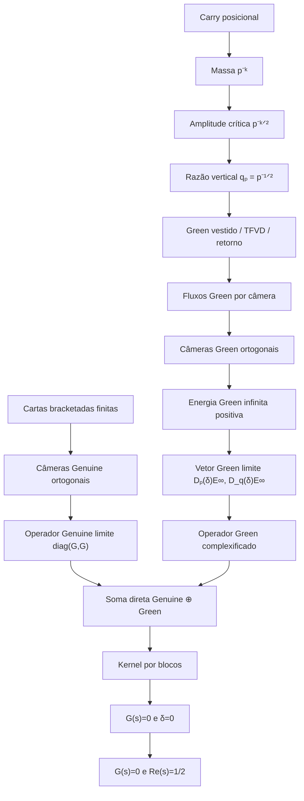

> **Arquivo histórico.** A definição antiga que incluía compatibilidade de
> massa no “zero nativo” foi substituída. O operador completado testa dois
> canais; ele não redefine o zero Genuine/nativo. Consulte
> `docs/NATIVE_ZERO_SEMANTICS_CORRECTION.md`.

# Cronologia da construção do operador completado Genuine–Green

## Da informação perdida pela síntese escalar à soma direta que preserva o canal de massa do carry

> **Resumo em uma linha:** o operador completado nasceu quando ficou claro que o Genuine e o Green não eram duas fórmulas concorrentes para o mesmo número. Eles eram dois canais independentes: o Genuine registrava o fechamento escalar das cartas bracketadas, enquanto o Green preservava o desequilíbrio radial da amplitude do carry. A construção correta não foi somar esses números, mas mantê-los em blocos ortogonais:
>
> `operador completado = operador Genuine ortogonal ⊕ operador Green alinhado`.

O resultado formal ficou:

```text
genuineGreenCompletedLimitOperator p q s = 0
↔ genuineContinuation s = 0
  ∧ criticalDisplacement s.re = 0
↔ genuineContinuation s = 0
  ∧ s.re = 1/2.
```

---

# 1. Nota sobre as datas e as fontes

Este documento combina:

1. **o histórico recuperado das conversas**, no qual a interpretação humana da construção foi se tornando explícita;
2. **os metadados dos commits e pull requests**, que registram a ordem em que as peças foram formalizadas e auditadas no Lean;
3. **os módulos atuais do repositório**, usados para conferir os nomes exatos das definições e dos teoremas.

Todos os horários foram convertidos para o fuso de Brasília:

```text
America/Sao_Paulo = UTC-3.
```

É importante registrar uma particularidade dessa história:

> **A construção formal do operador completado foi fechada em 22/07/2026. A compreensão conversacional mais nítida de por que ele era necessário amadureceu no dia seguinte, 23/07/2026.**

Ou seja: primeiro a arquitetura matemática encaixou; depois a interpretação ficou cristalina.

---

# 2. O problema que exigiu um operador completado

A síntese Genuine é escalar. Esquematicamente, ela comprime uma estrutura de muitas contribuições para um único número complexo:

```text
estado multicanal
→ brackets
→ cartas
→ síntese escalar Genuine G(s).
```

Quando

```text
G(s) = 0,
```

sabemos que esse readout escalar fechou.

Mas isso não significa automaticamente que toda a informação geométrica anterior à compressão tenha desaparecido.

O exemplo mais simples é um vetor cujas duas coordenadas de câmera valem `1`:

```text
(z_p, z_q) = (1, 1).
```

Uma compressão por diferença produz

```text
1 - 1 = 0,
```

mas a energia ortogonal é

```text
1² + 1² = 2.
```

Portanto:

```text
cancelamento escalar ≠ anulação do estado antes da compressão.
```

Essa distinção tornou-se central na pesquisa.

O Genuine podia zerar como síntese, enquanto o Green ainda preservava uma componente radial associada à amplitude do carry.

O problema não era “corrigir” o Genuine. O problema era **não deixar que a compressão Genuine apagasse o canal Green antes de ele ser medido**.

---

# 3. O que significa “completado” neste projeto

O nome não significa:

- completamento de Cauchy de um espaço ainda incompleto;
- extensão autoadjunta automática;
- fechamento de um operador não limitado;
- soma numérica do Genuine com o Green;
- adição de um residual escolhido para fabricar um kernel desejado.

Aqui, “completado” significa:

> **completar o conjunto de observáveis preservados pelo operador.**

O primeiro canal registra:

```text
fechamento Genuine das câmeras bracketadas.
```

O segundo registra:

```text
desequilíbrio Green da amplitude do carry.
```

Em vez de comprimir um no outro, os dois são mantidos numa soma direta:

```text
H_completed = H_Genuine ⊕ H_Green.
```

No Lean, os dois blocos foram colocados num produto:

```lean
abbrev GenuineGreenCompletedSpace :=
  TwoPrimeGenuineHilbert × TwoPrimeGenuineHilbert
```

A palavra “completado” é, portanto, uma afirmação de **conservação de informação**.

---

# 4. As duas informações que precisavam permanecer separadas

## 4.1. Canal Genuine

O canal Genuine responde:

```text
As cartas bracketadas fecham no limite?
```

O operador limite é diagonal:

```text
diag(G(s), G(s)).
```

As duas câmeras são mantidas em coordenadas ortogonais, mas, depois da normalização, ambas convergem para o mesmo coeficiente canônico:

```text
genuineContinuation s.
```

## 4.2. Canal Green

O canal Green responde:

```text
A amplitude está no equilíbrio radial imposto pelo carry?
```

Num zero Genuine, depois que o bordo bracketado fecha, cada câmera conserva o bulk

```text
D_p(δ(s)) E∞(s),
```

onde

```text
δ(s) = criticalDisplacement(s.re) = s.re - 1/2,
```

```text
D_p(δ) = cpRadialDifference p δ,
```

```text
E∞(s) = infiniteReflectedGreenEnergy s > 0.
```

Como a energia é estritamente positiva,

```text
D_p(δ) E∞(s) = 0
↔ D_p(δ) = 0
↔ δ = 0
↔ Re(s) = 1/2.
```

O canal Genuine detecta o zero escalar.

O canal Green detecta a compatibilidade transversal da massa/amplitude.

O operador completado exige que ambos fechem simultaneamente.

---

# 5. Pré-história: as peças que precisavam existir antes do operador

O operador completado não surgiu de uma definição isolada. Ele só pôde ser construído porque a pesquisa já tinha produzido uma sequência de objetos independentes.

## 5.1. Massa e amplitude do carry

Para uma base `p` e profundidade `k`:

```text
massa = p^(-k),
```

```text
amplitude crítica = p^(-k/2).
```

A relação fundamental era

```text
amplitude² = massa.
```

Commit de fundação:

- [`f65e778a`](https://github.com/thiagomassensini/primos/commit/f65e778a7628e01e209133ce791f4eda3c99312e) — **18/07/2026, 09h20** — `formalize Cp carry depth weights and amplitudes`.

## 5.2. Identidade Green separando bulk e bordo

A forma assinada foi organizada como

```text
flux = 2 × criticalDisplacement × radialEnergy + boundary.
```

Commit:

- [`7269cf54`](https://github.com/thiagomassensini/primos/commit/7269cf54578cced29fcb77665b83d3c7b16ef60c) — **18/07/2026, 14h33** — `factor the signed Green bridge`.

Esse passo foi importante porque manteve três objetos independentes:

- fluxo;
- energia radial;
- bordo.

O bordo não foi definido como um residual tautológico.

## 5.3. Semente e bordo bracketado

Na câmera `3`, a semente vale exatamente `+1`.

O bordo Green cru possui endpoint interno `+1` e tende a `-1` depois da subtração do endpoint externo.

A carta bracketada e o bordo foram acoplados sem apagar o bulk radial.

Commit:

- [`427022ce`](https://github.com/thiagomassensini/primos/commit/427022cef54bbb27e148ab4accee5fcf3b28625b) — **19/07/2026, 19h21** — `couple canonical bracket trace to Green boundary`.

## 5.4. TFVD, retorno e reconstrução

Entre 19 e 21 de julho, bracket, traço, retorno e Green foram colocados na mesma arquitetura de válvula.

O ponto culminante foi:

```text
G_q B_q + R_q Tr_q = I.
```

Commit:

- [`51fe62af`](https://github.com/thiagomassensini/primos/commit/51fe62af30a8c3252db8a73e6acd48b58bc83370) — **21/07/2026, 17h57** — `Close full weighted vertical TFVD identity`.

Essa identidade mostrou que a massa e o bordo não eram anexos decorativos. Eram componentes necessárias para reconstruir o estado completo.

## 5.5. Correção da escala do Green

Em **21/07/2026, às 14h16**, foi formulado o insight:

```text
massa p^(-k)
→ amplitude p^(-k/2)
→ Green vestido com núcleo r p^(-r/2).
```

O Green ponderado entrou no Lean às **15h03**:

- [`5a463275`](https://github.com/thiagomassensini/primos/commit/5a4632754e1d3d63e58be9eb3d484810e3e1d32a) — `formalize carry-weighted vertical Green kernel`.

Essa correção foi decisiva para o operador completado porque identificou o canal Green como o portador legítimo da amplitude do carry, não como uma correção externa ao Genuine.

---

# 6. 22/07/2026 — preservação ortogonal das câmeras Green

## 03h28 — as câmeras deixam de ser somadas antes da energia

Commit:

- [`ba0b20a8`](https://github.com/thiagomassensini/primos/commit/ba0b20a8471f0b0d9f54de15feddf48480623baa) — `Formalize orthogonal multibase Green coordinates`.

Arquivo:

```text
CPFormal/Analytic/CpGenuineFirstOrthogonalMultibaseGreen.lean
```

A motivação foi registrada de forma explícita no módulo:

```text
A compressão escalar de duas câmeras pode permitir cancelamento
antes que a energia seja medida.
```

A solução foi representar as duas câmeras em

```text
TwoPrimeGreenHilbert := EuclideanSpace ℝ (Fin 2).
```

O vetor

```text
(x_p, x_q)
```

passou a ter energia

```text
‖(x_p,x_q)‖² = x_p² + x_q².
```

Não existe termo cruzado entre as câmeras.

Teorema Lean:

```text
twoPrimeGreenVector_inner_self
```

A identidade Green passou à forma vetorial:

```text
GreenFluxVector
=
RadialBulkVector
+
BoundaryVector.
```

Teorema Lean:

```text
crossPrimeAlignedGreenFluxVector_eq_radial_add_boundary
```

O bulk radial vetorial zera exatamente quando

```text
criticalDisplacement(s.re) = 0.
```

Teorema Lean:

```text
crossPrimeAlignedRadialBulkVector_eq_zero_iff_criticalDisplacement_eq_zero
```

Essa foi a primeira metade conceitual do operador completado:

> **não comprimir as câmeras antes de medir a energia que cada uma conserva.**

---

# 7. 22/07/2026 — construção do operador Genuine ortogonal

## 04h59 — as duas câmeras Genuine são preservadas até o limite

Commit:

- [`c1dcbb0e`](https://github.com/thiagomassensini/primos/commit/c1dcbb0e29499d274777190ba6f30045460f42ca) — `Formalize the orthogonal Genuine operator limit`.

Arquivo:

```text
CPFormal/Analytic/CpGenuineFirstOrthogonalLimit.lean
```

O espaço foi definido como

```text
TwoPrimeGenuineHilbert := EuclideanSpace ℂ (Fin 2).
```

As câmeras `p` e `q` ocupam eixos ortogonais.

Teorema:

```text
firstPrimeGenuineAxis_inner_secondPrimeGenuineAxis
```

Cada câmera finita normalizada converge para

```text
genuineContinuation s.
```

Teorema:

```text
finiteNormalizedGenuineCamera_tendsto_genuineContinuation
```

O operador finito é diagonal, sem soma entre câmeras:

```text
finiteAlignedOrthogonalGenuineOperator p q L s.
```

O operador limite é

```text
orthogonalGenuineLimitOperator s
=
diag(genuineContinuation s, genuineContinuation s).
```

Teorema de ação:

```text
orthogonalGenuineLimitOperator_apply
```

Ele prova que o operador é simplesmente a multiplicação escalar pelo Genuine em cada eixo:

```text
orthogonalGenuineLimitOperator s v
=
genuineContinuation s • v.
```

A passagem ao limite é forte, estado por estado:

```text
finiteAlignedOrthogonalGenuineOperator_tendsto_apply.
```

Num zero Genuine:

```text
orthogonalGenuineLimitOperator s = 0.
```

Teorema:

```text
orthogonalGenuineLimitOperator_eq_zero_of_genuine_zero
```

Essa foi a segunda metade necessária:

> **o canal Genuine também precisava virar um operador em coordenadas ortogonais, para poder ser combinado com o Green sem mistura escalar.**

---

# 8. 22/07/2026 — passagem ao infinito do grafo Green

## 06h17 — o bulk Green ganha um vetor-limite positivo e explícito

Commit:

- [`6e74a74b`](https://github.com/thiagomassensini/primos/commit/6e74a74b070f94c5f53c2e6f54d6525f70e5268a) — `Add orthogonal Green graph limit`.

Arquivo:

```text
CPFormal/Analytic/CpGenuineFirstOrthogonalGreenLimit.lean
```

Primeiro, as arestas refletidas foram majoradas por uma série de ordem

```text
(n+1)^(-3).
```

Isso permitiu definir a energia Green infinita:

```text
infiniteReflectedGreenEnergy s.
```

E provar:

```text
infiniteReflectedGreenEnergy s > 0
```

em todo o strip Genuine.

Teorema:

```text
infiniteReflectedGreenEnergy_pos
```

Num zero Genuine, o bordo acoplado desaparece, mas o fluxo de cada câmera converge para

```text
cpRadialDifference p (criticalDisplacement s.re)
× infiniteReflectedGreenEnergy s.
```

Teorema:

```text
finiteBracketCoupledCpGreenFlux_tendsto_infiniteBulk_of_genuine_zero
```

Foi então definido o vetor Green limite:

```text
crossPrimeAlignedGreenLimitVector p q s
=
(
  D_p(δ) E∞(s),
  D_q(δ) E∞(s)
).
```

Como `E∞(s)>0`, o vetor zera exatamente quando

```text
δ = 0.
```

Teorema:

```text
crossPrimeAlignedGreenLimitVector_eq_zero_iff_criticalDisplacement_eq_zero
```

Nesse mesmo arquivo apareceu, antes do operador completado, a caracterização do **kernel conjunto**:

```text
orthogonalGenuineLimitOperator s = 0
∧ crossPrimeAlignedGreenLimitVector p q s = 0
↔ genuineContinuation s = 0
  ∧ criticalDisplacement s.re = 0.
```

Teorema:

```text
orthogonalGenuineGreenJointKernel_iff
```

Essa equivalência já continha toda a lógica do operador completado.

Ainda faltava empacotar o vetor Green como operador e unir formalmente os dois canais numa única ação linear.

---

# 9. 22/07/2026 — primeiro checkpoint integrado Genuine-first

## 08h31 — merge do PR #3

Pull request:

- [PR #3 — Formalize Genuine-first cutoff, orthogonal Green, and Genuine limit](https://github.com/thiagomassensini/primos/pull/3)

Merge commit:

- [`6dcecd52`](https://github.com/thiagomassensini/primos/commit/6dcecd52ff0e46ea7599892ba1d1ded62e5dd4ab) — **22/07/2026, 08h31**.

Esse PR reuniu:

```text
cutoff preservado como informação
→ comparação multibase
→ câmeras Green ortogonais
→ operador Genuine ortogonal
→ energia Green infinita
→ vetor Green limite
→ kernel conjunto.
```

A arquitetura já sabia que

```text
zero Genuine
```

e

```text
equilíbrio radial
```

eram condições independentes.

O PR ainda não chamava a colagem de “operador completado”, mas deixou as duas peças prontas e tipadas.

---

# 10. 22/07/2026 — a amplitude vertical é identificada com a amplitude crítica do carry

Antes de montar o bloco final, foi necessário provar que a razão usada pela geometria vertical não era uma calibração inventada para o Green.

Foi formalizado:

```text
primeCarryAmplitudeRatio p
=
criticalAmplitude p 1.
```

Ou seja:

```text
1/sqrt(p) = p^(-1/2).
```

Teorema:

```text
primeCarryAmplitudeRatio_eq_criticalAmplitude_one
```

Para uma base prima:

```text
branchAmplitude p sigma 1
=
primeCarryAmplitudeRatio p
↔ sigma = 1/2.
```

Teorema:

```text
branchAmplitude_one_eq_primeCarryAmplitudeRatio_iff
```

Arquivo:

```text
CPFormal/Analytic/CpCarryAmplitudeIdentification.lean
```

Essa identificação conectou diretamente:

```text
massa do carry
→ amplitude crítica
→ razão vertical q_p
→ Green
→ condição transversal do operador completado.
```

O canal Green não estava acrescentando uma condição externa ao carry. Ele estava lendo exatamente a amplitude que o carry já havia determinado.

---

# 11. 22/07/2026 — nascimento formal do operador completado

## 12h14 — abertura do PR #5

Pull request:

- [PR #5 — Formalize the carry-completed Genuine operator](https://github.com/thiagomassensini/primos/pull/5)

Horário de abertura:

```text
22/07/2026, 12h14, horário de Brasília.
```

Head matemático:

- [`7a7d4f50`](https://github.com/thiagomassensini/primos/commit/7a7d4f50eec810b2826c721c565630d152e605e7) — `Formalize carry-completed Genuine operator`.

O PR acrescentou três arquivos ao checkpoint:

```text
CpCarryAmplitudeIdentification.lean
CpGenuineGreenCompletedOperator.lean
CPFormal.lean
```

## 11.1. Complexificação do vetor Green

O vetor Green limite vivia num espaço real:

```text
TwoPrimeGreenHilbert = ℝ².
```

Para colocá-lo como bloco ao lado do operador Genuine complexo, cada coordenada real foi promovida a coeficiente complexo de um operador diagonal:

```lean
def complexifiedAlignedGreenLimitOperator
    (p q : ℕ) (s : ℂ) : Module.End ℂ TwoPrimeGenuineHilbert :=
  twoPrimeGenuineDiagonalOperator
    ((crossPrimeAlignedGreenLimitVector p q s 0 : ℝ) : ℂ)
    ((crossPrimeAlignedGreenLimitVector p q s 1 : ℝ) : ℂ)
```

Isso não altera o locus de zeros.

Teorema:

```text
complexifiedAlignedGreenLimitOperator_eq_zero_iff_limitVector_eq_zero
```

Logo:

```text
complexifiedAlignedGreenLimitOperator p q s = 0
↔ criticalDisplacement s.re = 0.
```

Teorema:

```text
complexifiedAlignedGreenLimitOperator_eq_zero_iff_criticalDisplacement_eq_zero
```

## 11.2. Espaço completado

Foi definido:

```lean
abbrev GenuineGreenCompletedSpace :=
  TwoPrimeGenuineHilbert × TwoPrimeGenuineHilbert
```

O primeiro componente é o bloco Genuine.

O segundo é o bloco Green complexificado.

## 11.3. Operador finito completado

```lean
def finiteGenuineGreenCompletedOperator
    (p q L : ℕ) (s : ℂ) : Module.End ℂ GenuineGreenCompletedSpace :=
  (finiteAlignedOrthogonalGenuineOperator p q L s).prodMap
    (finiteComplexifiedAlignedGreenFluxOperator p q L s)
```

Ele preserva, em cada cutoff:

```text
readout Genuine finito
⊕
fluxo Green finito.
```

## 11.4. Operador limite completado

A definição central foi:

```lean
def genuineGreenCompletedLimitOperator
    (p q : ℕ) (s : ℂ) : Module.End ℂ GenuineGreenCompletedSpace :=
  (orthogonalGenuineLimitOperator s).prodMap
    (complexifiedAlignedGreenLimitOperator p q s)
```

Em notação matemática:

```text
C_{p,q}(s)
=
G∞(s) ⊕ L_{p,q}(s).
```

Para um estado

```text
v = ((x_p,x_q),(y_p,y_q)),
```

o operador age como

```text
C_{p,q}(s)v
=
(
  (G(s)x_p, G(s)x_q),
  (D_p(δ)E∞(s)y_p, D_q(δ)E∞(s)y_q)
).
```

Não há:

- soma entre Genuine e Green;
- termo cruzado entre as câmeras;
- coeficiente escolhido em função de um zero;
- cancelamento permitido entre os dois blocos.

Essa é a construção do operador completado propriamente dita.

---

# 12. O lema algébrico que faz a soma direta funcionar

Para dois endomorfismos `A` e `B`, foi provado:

```text
A.prodMap B = 0
↔ A = 0 ∧ B = 0.
```

Teorema Lean:

```text
linearMap_prodMap_eq_zero_iff
```

A prova avalia o operador produto nos estados

```text
(v,0)
```

e

```text
(0,w).
```

Assim:

```text
(A⊕B)(v,0) = (Av,0),
```

```text
(A⊕B)(0,w) = (0,Bw).
```

Se o operador total é zero, cada bloco precisa ser zero separadamente.

Não existe cancelamento entre os blocos de uma soma direta.

Aplicado ao caso Genuine–Green:

```text
genuineGreenCompletedLimitOperator p q s = 0
↔ orthogonalGenuineLimitOperator s = 0
  ∧ complexifiedAlignedGreenLimitOperator p q s = 0.
```

Teorema:

```text
genuineGreenCompletedLimitOperator_eq_zero_iff_components
```

---

# 13. A caracterização completa do kernel

Já estavam provadas as duas equivalências:

```text
orthogonalGenuineLimitOperator s = 0
↔ genuineContinuation s = 0,
```

```text
complexifiedAlignedGreenLimitOperator p q s = 0
↔ criticalDisplacement s.re = 0.
```

Portanto:

```text
genuineGreenCompletedLimitOperator p q s = 0
↔ genuineContinuation s = 0
  ∧ criticalDisplacement s.re = 0.
```

Teorema central:

```text
genuineGreenCompletedLimitOperator_eq_zero_iff
```

Como

```text
criticalDisplacement s.re = 0
↔ s.re = 1/2,
```

obteve-se:

```text
genuineGreenCompletedLimitOperator p q s = 0
↔ genuineContinuation s = 0
  ∧ s.re = 1/2.
```

Teorema:

```text
genuineGreenCompletedLimitOperator_eq_zero_iff_re_eq_half
```

E, consequentemente:

```text
s.re ≠ 1/2
→ genuineGreenCompletedLimitOperator p q s ≠ 0.
```

Teorema:

```text
genuineGreenCompletedLimitOperator_ne_zero_of_re_ne_half
```

Esse resultado é incondicional para o operador completado no strip.

---

# 14. 22/07/2026, 14h51 — integração no `main`

Merge commit:

- [`c6c25e60`](https://github.com/thiagomassensini/primos/commit/c6c25e60ae1cb69f5d6c2973b33389c2858dafd0) — `Merge PR #5: Carry-completed Genuine operator`.

Horário:

```text
22/07/2026, 14h51, horário de Brasília.
```

O commit registrou:

```text
carry-amplitude identification
+
completed Genuine–Green operator
+
Lean kernel audit run 424 green.
```

O PR continha um único commit matemático e 451 linhas novas distribuídas em três arquivos.

Nesse momento, a construção formal do operador completado estava concluída.

---

# 15. Proveniência: o operador limite não apareceu do nada

O operador completado também ganhou uma versão finita.

Num zero Genuine, para cada estado do espaço completado, foi provada convergência forte:

```text
finiteGenuineGreenCompletedOperator p q L s v
→
genuineGreenCompletedLimitOperator p q s v.
```

Teorema:

```text
finiteGenuineGreenCompletedOperator_tendsto_apply_of_genuine_zero
```

A prova combina:

1. a convergência forte do operador Genuine finito;
2. a convergência das duas coordenadas Green finitas para o bulk Green explícito.

Portanto, o operador limite preserva a proveniência das construções finitas.

Ele não foi definido apenas no infinito para obter um kernel conveniente.

A cadeia é:

```text
câmeras finitas
+
fluxos Green finitos
→ operadores finitos em bloco
→ limite forte
→ operador completado.
```

---

# 16. A restrição à órbita real-espectral

Na órbita nativa:

```text
s_t = 1/2 + it.
```

Por construção:

```text
criticalDisplacement(s_t.re) = 0.
```

Assim, o bloco Green já está equilibrado.

O operador completado reduz ao bloco Genuine:

```text
genuineGreenCompletedLimitOperator p q (criticalLineParameter t) = 0
↔ realSpectralGenuine t = 0.
```

Teorema:

```text
genuineGreenCompletedLimitOperator_criticalLine_eq_zero_iff
```

Isso produz dois regimes claros:

| Regime | Bloco Green | Condição para o operador completado zerar |
|---|---:|---|
| `Re(s) ≠ 1/2` | não pode zerar | impossível |
| `s = 1/2 + it` | equilibrado | `realSpectralGenuine t = 0` |

A parte real fixa a amplitude.

O tempo real `t` movimenta apenas a fase e a ressonância.

---

# 17. 23/07/2026 — a interpretação humana fica explícita

## 12h32 — preservar câmeras, não comprimi-las

Na conversa recuperada, a arquitetura foi explicada como a preservação de um vetor de câmeras:

```text
Z_L = (Z_{p,L}, Z_{q,L}).
```

A ideia foi separar:

```text
síntese escalar
```

de

```text
energia coordenada a coordenada.
```

A conclusão foi que o operador completado deveria conservar os dois registros em soma direta.

## 12h48 — o exemplo do cancelamento com energia positiva

Foi explicitado o exemplo:

```text
(z_p,z_q) = (1,1).
```

A compressão por diferença fornece

```text
z_p - z_q = 0,
```

mas a energia é

```text
|z_p|² + |z_q|² = 2.
```

Isso tornou visual a razão de o Genuine escalar não poder substituir o canal Green.

## 13h08 — o zero é reconhecido como ponto cego escalar

A interpretação amadureceu para:

```text
1/2 é a amplitude estrutural do carry;
```

```text
t é a variável de fase/ressonância;
```

```text
o zero Genuine é um fechamento da síntese,
não uma declaração de que toda energia pré-compressão desapareceu.
```

Em outras palavras:

> **o operador completado foi construído no Lean em 22 de julho; em 23 de julho ficou intelectualmente claro que ele era o operador que preservava a massa escondida pelo zero escalar.**

---

# 18. O papel da massa na construção

A condição transversal do kernel pode ser escrita como

```text
branchAmplitude p s.re 1
=
primeCarryAmplitudeRatio p.
```

Teorema:

```text
genuineGreenCompletedLimitOperator_eq_zero_iff_carryAmplitude
```

Isso equivale a

```text
p^(-s.re) = p^(-1/2).
```

Logo:

```text
s.re = 1/2.
```

Assim, a construção completa pode ser lida como:

```text
carry fornece massa p^(-k)
→ norma quadrática fornece amplitude p^(-k/2)
→ Green mede o defeito de amplitude
→ Genuine mede o fechamento bracketado
→ soma direta exige ambos
→ kernel total fixa Re(s)=1/2 e a ressonância Genuine.
```

O operador completado não acrescenta massa ao Genuine.

Ele impede que a massa já existente seja descartada pela síntese escalar.

---

# 19. Relação com a correção de escala do Green

A correção de escala e o operador completado são acontecimentos distintos, mas encadeados.

## Correção de escala

Pergunta:

```text
Como o Green deve transportar informação entre profundidades do carry?
```

Resposta:

```text
com amplitude p^(-k/2),
não com massa p^(-k) aplicada diretamente ao vetor.
```

Resultado:

```text
núcleo r p^(-r/2)
```

e identidade

```text
G_q B_q + R_q Tr_q = I.
```

## Operador completado

Pergunta:

```text
Como impedir que a síntese Genuine apague a informação Green radial?
```

Resposta:

```text
manter Genuine e Green em blocos ortogonais de uma soma direta.
```

Resultado:

```text
C(s)=0
↔ G(s)=0 ∧ amplitude compatível com o carry.
```

Portanto:

```text
correção de escala
→ legitima o canal Green;
```

```text
operador completado
→ conserva esse canal ao lado do Genuine.
```

---

# 20. O que o operador completado provou

O Lean provou, sem axioma novo:

## 20.1. Kernel por componentes

```text
completed = 0
↔ GenuineBlock = 0 ∧ GreenBlock = 0.
```

## 20.2. Kernel intrínseco

```text
completed = 0
↔ genuineContinuation s = 0
  ∧ criticalDisplacement s.re = 0.
```

## 20.3. Forma em coordenada

```text
completed = 0
↔ genuineContinuation s = 0
  ∧ s.re = 1/2.
```

## 20.4. Não anulação fora da meia-abscissa

```text
s.re ≠ 1/2
→ completed ≠ 0.
```

## 20.5. Proveniência finita

```text
finiteCompleted_L(s)v
→ completed(s)v
```

no locus Genuine apropriado.

## 20.6. Restrição real-espectral

```text
completed(1/2+it)=0
↔ realSpectralGenuine(t)=0.
```

---

# 21. O que ele deliberadamente não provou

A distinção mais importante é:

```text
operador completado não nulo fora da linha
```

não é a mesma afirmação que

```text
Genuine escalar não nulo fora da linha.
```

O teorema

```text
genuineGreenCompletedLimitOperator_ne_zero_of_re_ne_half
```

diz:

```text
se Re(s) ≠ 1/2,
o bloco Green mantém o operador total não nulo.
```

Ele não diz:

```text
se Re(s) ≠ 1/2,
genuineContinuation s ≠ 0.
```

É perfeitamente coerente com os teoremas existentes que, hipoteticamente,

```text
genuineContinuation s = 0
```

fora da meia-abscissa, enquanto

```text
GreenBlock(s) ≠ 0
```

e, portanto,

```text
CompletedOperator(s) ≠ 0.
```

Isso não é uma fraqueza escondida. É justamente o motivo da existência do operador completado: preservar a informação que o escalar Genuine não registra.

Também não foi provado automaticamente que:

- todo zero Genuine bruto promove-se a zero do operador completado;
- o zero escalar reconstrói a compatibilidade de massa pré-compressão;
- o bracket vestido é automaticamente simétrico ou autoadjunto;
- o bloco Green pode ser descartado depois de a soma direta ser construída.

---

# 22. Guardrails posteriores

A formalização continuou testando o significado do operador completado.

## 24/07 — amplitude ligada ao traço TFVD

Commit:

- [`14114907`](https://github.com/thiagomassensini/primos/commit/1411490782cf0b3f4a0a4d1a44079c3f33e1c862) — `Identify prime amplitude upgrade with the vertical TFVD trace`.

Esse passo mostrou que a amplitude preservada pelo bloco Green também aparece como dado de porta no TFVD vertical.

## 24/07 — no-go de norma de grafo

Commit:

- [`2e73b945`](https://github.com/thiagomassensini/primos/commit/2e73b9458da38084c2ebf312ab0b98640d96c36f) — `Add vertical TFVD graph-norm no-go witness`.

O resultado protege contra a inferência indevida:

```text
compressão escalar zero
→ energia de grafo zero.
```

## 25/07 — amplitude crítica como linguagem espectral

Commit:

- [`0d4a98e6`](https://github.com/thiagomassensini/primos/commit/0d4a98e638c9d927e63e8d4f7fd6f8d3b21a4aab) — `Express native spectrum exhaustion as critical-amplitude preservation`.

O operador completado passou a ser interpretado diretamente como preservação da amplitude crítica sob evolução temporal.

## 25/07 — o bracket vestido não é automaticamente simétrico

Commit:

- [`7acf3a8a`](https://github.com/thiagomassensini/primos/commit/7acf3a8a56f58cf030cb9f92c6f085e94bd6f59f) — `Prove dressed vertical bracket is not symmetric on amplitude l2`.

Esse guardrail separou:

```text
reconstrução exata e conservação de informação
```

de

```text
simetria/autoadjunticidade de uma realização operatorial.
```

---

# 23. 30–31/07/2026 — o operador completado retorna à arquitetura nativa

Depois da consolidação do operador real nativo, a soma direta Genuine–Green foi usada como interface de crosswalk.

## 30/07 — PR #27

Pull request:

- [PR #27 — Close the native Genuine Green completed crosswalk](https://github.com/thiagomassensini/primos/pull/27)

O teorema central do draft foi:

```text
IsNativeCarryRealOperatorZero 3 s.re s.im
↔ genuineGreenCompletedLimitOperator p q s = 0.
```

Esse crosswalk preservou explicitamente que o zero nativo contém a condição de massa, e que o operador completado a mantém no bloco Green.

Ele não declarou:

```text
zero Genuine bruto
→ compatibilidade de massa.
```

## 31/07 — probes de confinamento bruto

Os probes das PRs #31 e #32 mostraram que promover diretamente um zero Genuine bruto ao zero nativo/completado reduz exatamente ao goal

```text
s.re = 1/2.
```

Isso confirmou retrospectivamente a arquitetura:

```text
Genuine bruto fecha o canal escalar;
Green completado preserva o canal de massa;
a seta entre os dois é exatamente a obrigação crítica restante.
```

O operador completado não escondeu o problema. Ele o tipou corretamente.

---

# 24. Por que a construção não é circular

A soma direta foi construída depois que seus dois blocos já existiam independentemente.

Antes da definição de

```text
genuineGreenCompletedLimitOperator,
```

a formalização já possuía:

- câmeras Genuine finitas normalizadas;
- operador Genuine ortogonal finito;
- operador Genuine ortogonal no limite;
- convergência forte do canal Genuine;
- fluxos Green finitos por câmera;
- identidade Green vetorial;
- bordo bracketado independente;
- energia Green infinita positiva;
- vetor Green limite explícito;
- caracterização do zero do vetor Green;
- kernel conjunto dos dois objetos.

O operador completado apenas aplicou a construção canônica

```text
(A,B) ↦ A ⊕ B.
```

Nenhum coeficiente foi escolhido depois de observar um zero.

Nenhum bloco foi definido como “o que falta” para obter a conclusão.

Nenhum kernel foi postulado.

A informação já existia em dois registros; o operador apenas passou a preservá-la num único portador.

---

# 25. Mapa dos objetos e teoremas Lean

| Papel | Definição ou teorema | Arquivo |
|---|---|---|
| massa do carry | `criticalMass` | `CPFormal/Carry/CpBranchWeight.lean` |
| amplitude crítica | `criticalAmplitude` | `CPFormal/Carry/CpBranchWeight.lean` |
| amplitude² = massa | `criticalAmplitude_sq_eq_mass` | `CPFormal/Carry/CpBranchWeight.lean` |
| razão vertical | `primeCarryAmplitudeRatio` | `CpCarryWeightedVerticalGreen.lean` |
| razão = amplitude crítica | `primeCarryAmplitudeRatio_eq_criticalAmplitude_one` | `CpCarryAmplitudeIdentification.lean` |
| rigidez da amplitude | `branchAmplitude_one_eq_primeCarryAmplitudeRatio_iff` | `CpCarryAmplitudeIdentification.lean` |
| Hilbert de câmeras Genuine | `TwoPrimeGenuineHilbert` | `CpGenuineFirstOrthogonalLimit.lean` |
| operador Genuine finito | `finiteAlignedOrthogonalGenuineOperator` | `CpGenuineFirstOrthogonalLimit.lean` |
| operador Genuine limite | `orthogonalGenuineLimitOperator` | `CpGenuineFirstOrthogonalLimit.lean` |
| convergência forte Genuine | `finiteAlignedOrthogonalGenuineOperator_tendsto_apply` | `CpGenuineFirstOrthogonalLimit.lean` |
| kernel Genuine | `orthogonalGenuineLimitOperator_eq_zero_iff` | `CpGenuineFirstOrthogonalGreenLimit.lean` |
| Hilbert Green real | `TwoPrimeGreenHilbert` | `CpGenuineFirstOrthogonalMultibaseGreen.lean` |
| identidade Green vetorial | `crossPrimeAlignedGreenFluxVector_eq_radial_add_boundary` | `CpGenuineFirstOrthogonalMultibaseGreen.lean` |
| energia Green infinita | `infiniteReflectedGreenEnergy` | `CpGenuineFirstOrthogonalGreenLimit.lean` |
| positividade da energia | `infiniteReflectedGreenEnergy_pos` | `CpGenuineFirstOrthogonalGreenLimit.lean` |
| vetor Green limite | `crossPrimeAlignedGreenLimitVector` | `CpGenuineFirstOrthogonalGreenLimit.lean` |
| kernel Green | `crossPrimeAlignedGreenLimitVector_eq_zero_iff_criticalDisplacement_eq_zero` | `CpGenuineFirstOrthogonalGreenLimit.lean` |
| kernel conjunto pré-operador | `orthogonalGenuineGreenJointKernel_iff` | `CpGenuineFirstOrthogonalGreenLimit.lean` |
| bloco Green complexo | `complexifiedAlignedGreenLimitOperator` | `CpGenuineGreenCompletedOperator.lean` |
| espaço completado | `GenuineGreenCompletedSpace` | `CpGenuineGreenCompletedOperator.lean` |
| operador completado finito | `finiteGenuineGreenCompletedOperator` | `CpGenuineGreenCompletedOperator.lean` |
| operador completado limite | `genuineGreenCompletedLimitOperator` | `CpGenuineGreenCompletedOperator.lean` |
| soma direta zero por blocos | `linearMap_prodMap_eq_zero_iff` | `CpGenuineGreenCompletedOperator.lean` |
| kernel por componentes | `genuineGreenCompletedLimitOperator_eq_zero_iff_components` | `CpGenuineGreenCompletedOperator.lean` |
| kernel intrínseco | `genuineGreenCompletedLimitOperator_eq_zero_iff` | `CpGenuineGreenCompletedOperator.lean` |
| kernel em amplitude | `genuineGreenCompletedLimitOperator_eq_zero_iff_carryAmplitude` | `CpGenuineGreenCompletedOperator.lean` |
| kernel em coordenada | `genuineGreenCompletedLimitOperator_eq_zero_iff_re_eq_half` | `CpGenuineGreenCompletedOperator.lean` |
| não anulação off-critical | `genuineGreenCompletedLimitOperator_ne_zero_of_re_ne_half` | `CpGenuineGreenCompletedOperator.lean` |
| convergência forte completada | `finiteGenuineGreenCompletedOperator_tendsto_apply_of_genuine_zero` | `CpGenuineGreenCompletedOperator.lean` |
| restrição real-espectral | `genuineGreenCompletedLimitOperator_criticalLine_eq_zero_iff` | `CpGenuineGreenCompletedOperator.lean` |

---

# 26. Arquivos-fonte centrais

- [`CpGenuineFirstOrthogonalMultibaseGreen.lean`](https://github.com/thiagomassensini/primos/blob/main/CPFormal/Analytic/CpGenuineFirstOrthogonalMultibaseGreen.lean) — câmeras Green ortogonais, identidade vetorial, bulk e bordo sem cancelamento cruzado.
- [`CpGenuineFirstOrthogonalLimit.lean`](https://github.com/thiagomassensini/primos/blob/main/CPFormal/Analytic/CpGenuineFirstOrthogonalLimit.lean) — operador Genuine ortogonal finito, operador limite e convergência forte.
- [`CpGenuineFirstOrthogonalGreenLimit.lean`](https://github.com/thiagomassensini/primos/blob/main/CPFormal/Analytic/CpGenuineFirstOrthogonalGreenLimit.lean) — energia Green infinita, vetor Green limite e kernel conjunto.
- [`CpCarryAmplitudeIdentification.lean`](https://github.com/thiagomassensini/primos/blob/main/CPFormal/Analytic/CpCarryAmplitudeIdentification.lean) — razão vertical identificada com a amplitude crítica do carry.
- [`CpGenuineGreenCompletedOperator.lean`](https://github.com/thiagomassensini/primos/blob/main/CPFormal/Analytic/CpGenuineGreenCompletedOperator.lean) — definição do operador completado, kernel, não-anulação, proveniência finita e restrição real-espectral.

---

# 27. Cronologia compacta

| Data e hora | Evento | Hash / referência |
|---|---|---|
| 18/07, 09h20 | massa e amplitude do carry formalizadas | `f65e778a` |
| 18/07, 14h33 | Green assinado separado em fluxo, bulk e bordo | `7269cf54` |
| 19/07, 19h21 | semente bracketada acoplada ao bordo Green | `427022ce` |
| 21/07, 14h16 | insight da escala de amplitude do Green | conversa recuperada |
| 21/07, 15h03 | Green vertical vestido entra no Lean | `5a463275` |
| 21/07, 17h57 | identidade `G_q B_q + R_q Tr_q = I` | `51fe62af` |
| 22/07, 03h28 | câmeras Green preservadas ortogonalmente | `ba0b20a8` |
| 22/07, 04h59 | operador Genuine ortogonal limite | `c1dcbb0e` |
| 22/07, 06h17 | vetor Green limite e energia infinita | `6e74a74b` |
| 22/07, 08h31 | merge do checkpoint Genuine-first | `6dcecd52` / PR #3 |
| 22/07, 12h14 | abertura do PR do operador completado | PR #5 |
| 22/07, 14h51 | operador completado integrado e auditado | `c6c25e60` |
| 23/07, 12h32–13h08 | interpretação: zero escalar como ponto cego de energia | conversa recuperada |
| 24/07, 00h22 | amplitude ligada ao traço vertical TFVD | `14114907` |
| 24/07, 01h57 | no-go contra coerção escalar→energia | `2e73b945` |
| 25/07, 13h30 | amplitude crítica vira linguagem espectral | `0d4a98e6` |
| 25/07, 17h16 | guardrail de não-simetria automática | `7acf3a8a` |
| 30/07 | crosswalk nativo ↔ operador completado | PR #27 |
| 31/07 | probes reduzem promoção do zero bruto a `Re(s)=1/2` | PRs #31–#32 |

---

# 28. Grafo conceitual completo



---

# 29. Síntese final

A construção do operador completado seguiu esta lógica:

```text
1. O carry determinou uma massa.
2. A norma quadrática transformou a massa em amplitude.
3. O Green vestido preservou essa amplitude na direção vertical.
4. O bracket, o bordo e o retorno fecharam a reconstrução TFVD.
5. As câmeras Green foram colocadas em eixos ortogonais para impedir cancelamento cruzado.
6. As câmeras Genuine também foram promovidas a um operador ortogonal no limite.
7. O bulk Green ganhou uma energia infinita estritamente positiva.
8. O zero do Green passou a detectar exatamente o equilíbrio δ=0.
9. O zero do Genuine continuou detectando o fechamento escalar G(s)=0.
10. Os dois canais foram reunidos por soma direta, sem mistura.
```

Daí nasceu:

```text
genuineGreenCompletedLimitOperator
=
orthogonalGenuineLimitOperator
⊕
complexifiedAlignedGreenLimitOperator.
```

O operador completado não “consertou” o Genuine.

Ele fez algo mais fundamental:

> **impediu que a informação de massa do carry desaparecesse quando o readout Genuine fosse comprimido até zero.**

Seu kernel exige simultaneamente:

```text
fechamento escalar
+
equilíbrio da amplitude.
```

Por isso:

```text
completed zero
↔ Genuine zero ∧ Re(s)=1/2.
```

E por isso também o teorema do operador completado não deve ser confundido com uma prova sobre o escalar Genuine isolado.

A soma direta preservou exatamente o que a compressão escalar não conseguia enxergar.
